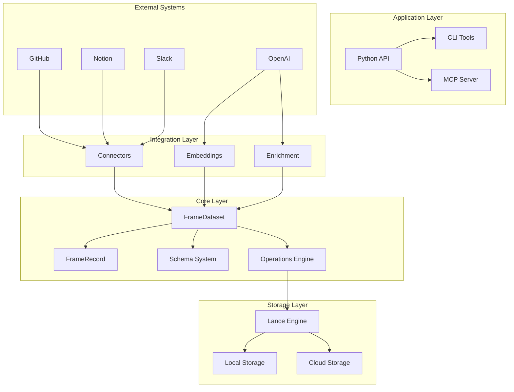

# Architecture Overview

ContextFrame is designed as a layered, extensible system for managing document context data for AI applications. This page provides a comprehensive overview of the architecture, design principles, and how components work together.

## Design Philosophy

ContextFrame follows these core principles:

1. **Simplicity First**: Easy to use for common cases, powerful when needed
2. **Storage Efficiency**: Columnar storage optimized for analytical queries
3. **AI-Native**: Built-in support for embeddings, LLM operations, and semantic search
4. **Extensibility**: Plugin architecture for connectors, custom metadata, and integrations
5. **Performance**: Zero-copy reads, lazy loading, and batch operations throughout

## System Architecture



## Core Components

### 1. Data Model Layer

The foundation of ContextFrame is built on two primary classes:

#### FrameRecord
The fundamental unit representing a document:
- **In-memory representation** of documents
- **Immutable by design** for consistency
- **Rich metadata support** with validation
- **Relationship tracking** between documents
- **Multi-modal support** (text, embeddings, binary data)

```python
# Conceptual structure
FrameRecord:
  - text_content: str           # Primary content
  - metadata: dict              # Structured metadata
  - vector: np.ndarray         # Embeddings
  - raw_data: bytes            # Binary data
  - relationships: list        # Document links
```

#### FrameDataset
High-level interface to Lance datasets:
- **CRUD operations** with atomic updates
- **Query capabilities** (vector, text, SQL-style)
- **Collection management** for organization
- **Version control** with time-travel
- **Performance optimization** (indices, compaction)

### 2. Schema System

ContextFrame uses a dual-schema architecture:

#### JSON Schema (Validation)
- **Purpose**: Validate metadata before storage
- **Location**: `contextframe_schema.json`
- **Features**: Pattern matching, conditionals, required fields
- **Extensibility**: Custom validation rules

#### Arrow Schema (Storage)
- **Purpose**: Define columnar storage format
- **Location**: `contextframe_schema.py`
- **Features**: Efficient storage, type safety, fast queries
- **Integration**: Direct mapping to Lance/Parquet

This separation allows flexible validation while maintaining storage efficiency.

### 3. Storage Layer (Lance)

Built on Lance, a modern columnar format:

#### Key Features
- **Versioned Storage**: Every write creates a new version
- **Columnar Format**: Efficient analytical queries
- **Vector Native**: First-class embedding support
- **Zero-Copy**: Memory-mapped file access
- **Cloud Native**: Works with S3, GCS, Azure

#### Storage Structure
```
dataset.lance/
├── _versions/      # Version manifests
├── _fragments/     # Data fragments
├── _indices/       # Vector/scalar indices
└── _deletions/     # Deletion vectors
```

### 4. Operations Engine

The operations layer provides high-level functionality:

#### Basic Operations
- **Add/Update/Delete**: Atomic operations with validation
- **Batch Operations**: Efficient bulk processing
- **Upsert Logic**: Insert or update based on UUID

#### Query Operations
- **Vector Search**: KNN with optional filters
- **Full-Text Search**: BM25-based text search
- **SQL Filtering**: Complex predicates on metadata
- **Hybrid Search**: Combine multiple query types

#### Advanced Features
- **Enrichment**: LLM-powered metadata generation
- **FrameSets**: Query results as new documents
- **Index Management**: Create/optimize indices
- **Compaction**: Optimize storage layout

### 5. Integration Layer

#### Connectors
Extensible system for external data sources:
- **Base Interface**: `SourceConnector` abstract class
- **Common Patterns**: Auth, sync, incremental updates
- **Built-in Connectors**: GitHub, Linear, Notion, Slack, etc.
- **Custom Support**: Easy to add new sources

#### Embeddings
Vector embedding support:
- **Multiple Providers**: OpenAI, Cohere, local models
- **Batch Processing**: Efficient embedding generation
- **Dimension Flexibility**: Support various embedding sizes
- **Caching**: Avoid re-embedding unchanged content

#### Enrichment
LLM-powered document enhancement:
- **Metadata Generation**: Tags, summaries, categories
- **Custom Prompts**: Flexible enrichment logic
- **Batch Support**: Process multiple documents
- **Provider Agnostic**: Works with any LLM

### 6. Access Layer

#### Python API
Primary programming interface:
```python
from contextframe import FrameDataset, FrameRecord

dataset = FrameDataset("my_data.lance")
doc = FrameRecord.create(title="...", content="...")
dataset.add(doc)
```

#### CLI Tools
Command-line interface for common operations:
```bash
contextframe create my_dataset.lance
contextframe import --source github --config config.json
contextframe search "query" --limit 10
```

#### MCP Server
AI agent integration via Model Context Protocol:
- **HTTP Transport**: RESTful API with SSE
- **Stdio Transport**: CLI integration
- **Tool Registry**: Expose operations as MCP tools
- **Security**: Multi-auth, rate limiting, audit logs

## Data Flow

### 1. Document Ingestion
```
External Source → Connector → Validation → FrameRecord → Storage
                     ↓
                  Embeddings
                     ↓
                  Enrichment
```

### 2. Query Processing
```
Query → Parser → Index Selection → Lance Scanner → Results
          ↓
     Vector/Text/SQL
```

### 3. MCP Integration
```
AI Agent → MCP Client → Transport → Handler → Dataset → Response
                           ↓
                    Authentication
                           ↓
                     Rate Limiting
```

## Design Patterns

### 1. Atomic Operations
Updates are implemented as delete-then-add for consistency:
```python
def update_record(self, uuid, new_record):
    self.delete_record(uuid)
    self.add(new_record)
```

### 2. Lazy Loading
Large binary data is loaded only when accessed:
```python
# Metadata loaded immediately
doc = dataset.get(uuid)

# Binary data loaded on access
if doc.raw_data:
    process_image(doc.raw_data)
```

### 3. Extension Points
Multiple ways to extend functionality:
- **Custom Metadata**: Add domain-specific fields
- **Custom Connectors**: New data sources
- **Custom Enrichment**: Specialized processing
- **Transport Adapters**: New MCP transports

### 4. Resource Lifecycle
Clear initialization, operation, and cleanup:
```python
# Initialize
dataset = FrameDataset.create("data.lance")

# Operate
dataset.add_many(documents)

# Cleanup
dataset.compact_files()
dataset.cleanup_old_versions()
```

## Performance Considerations

### 1. Batch Operations
Always prefer batch operations for multiple items:
```python
# Good
dataset.add_many(docs, batch_size=1000)

# Avoid
for doc in docs:
    dataset.add(doc)
```

### 2. Index Usage
Create appropriate indices for query patterns:
```python
# Vector search
dataset.create_vector_index(index_type="IVF_PQ")

# Metadata filtering
dataset.create_scalar_index("status")
dataset.create_scalar_index("author")
```

### 3. Projection Pushdown
Read only needed columns:
```python
scanner = dataset.scanner(
    columns=["uuid", "title", "tags"],
    filter="status = 'published'"
)
```

### 4. Memory Management
Use streaming for large operations:
```python
for batch in dataset.to_batches(batch_size=1000):
    process_batch(batch)
```

## Security Model

### 1. Authentication
Multiple authentication methods:
- **API Keys**: Simple token-based auth
- **OAuth 2.0**: For web applications
- **mTLS**: Certificate-based auth

### 2. Authorization
Fine-grained access control:
- **Dataset-level**: Read/write permissions
- **Operation-level**: Restrict specific operations
- **Field-level**: Hide sensitive metadata

### 3. Audit Logging
Comprehensive activity tracking:
- **Who**: User/application identity
- **What**: Operation performed
- **When**: Timestamp
- **Result**: Success/failure

## Deployment Patterns

### 1. Embedded Library
```python
# Direct usage in Python applications
from contextframe import FrameDataset
dataset = FrameDataset("local.lance")
```

### 2. Microservice
```python
# FastAPI service exposing ContextFrame
from fastapi import FastAPI
app = FastAPI()

@app.post("/documents")
async def add_document(doc: Document):
    dataset.add(doc.to_frame())
```

### 3. MCP Server
```bash
# Standalone MCP server
contextframe-mcp serve --port 8080 --dataset my_data.lance
```

### 4. Cloud Deployment
```python
# Using cloud storage
dataset = FrameDataset(
    "s3://bucket/datasets/prod.lance",
    storage_options={"region": "us-east-1"}
)
```

## Extensibility

### 1. Custom Connectors
```python
class CustomConnector(SourceConnector):
    def validate_connection(self): ...
    def discover_content(self): ...
    def sync(self): ...
    def map_to_frame(self): ...
```

### 2. Custom Record Types
```python
# Extend schema with new types
CUSTOM_RECORD_TYPES = RecordType._extend(
    "custom_type",
    "another_type"
)
```

### 3. Plugin System
Future support for plugins:
- **Storage Backends**: Alternative to Lance
- **Search Providers**: Custom search engines
- **Processing Pipelines**: Document transformers

## Best Practices

1. **Use Collections**: Organize related documents
2. **Tag Consistently**: Develop a tagging taxonomy
3. **Index Strategically**: Create indices for common queries
4. **Batch Operations**: Process documents in batches
5. **Version Control**: Use dataset versioning for safety
6. **Monitor Performance**: Track query times and resource usage

## Next Steps

- Understand the [Data Model](data-model.md) in detail
- Learn about the [Schema System](schema-system.md)
- Explore the [Storage Layer](storage-layer.md)
- See [Collections & Relationships](collections-relationships.md)