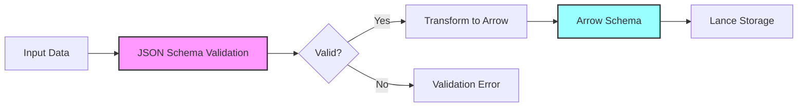

# Schema System

ContextFrame implements a sophisticated dual-schema architecture that provides both flexibility in validation and efficiency in storage. This design enables rich metadata validation while maintaining the performance benefits of columnar storage.

## Overview

The schema system consists of two complementary components:

1. **JSON Schema**: Defines validation rules and metadata structure
2. **Arrow Schema**: Defines the columnar storage format for Lance

This separation of concerns allows ContextFrame to:
- Validate data comprehensively before storage
- Store data efficiently in columnar format
- Evolve schemas with backward compatibility
- Support flexible custom metadata

## The Dual Schema Architecture



### Why Two Schemas?

1. **JSON Schema Advantages**:
   - Rich validation rules (patterns, conditionals, dependencies)
   - Human-readable and well-documented
   - Industry-standard format
   - Easy to extend and version

2. **Arrow Schema Advantages**:
   - Efficient columnar storage
   - Native support for nested data
   - Zero-copy operations
   - Direct integration with Lance/Parquet

## JSON Schema Details

The JSON Schema is located at `contextframe/schema/contextframe_schema.json` and defines the complete metadata structure.

### Core Structure

```json
{
  "$schema": "http://json-schema.org/draft-07/schema#",
  "title": "ContextFrame Record Schema",
  "type": "object",
  "required": ["uuid", "title", "created_at", "updated_at"],
  "properties": {
    "uuid": {
      "type": "string",
      "format": "uuid",
      "description": "Unique identifier for the record"
    },
    "title": {
      "type": "string",
      "minLength": 1,
      "description": "Human-readable title"
    },
    "created_at": {
      "type": "string",
      "format": "date-time",
      "description": "ISO 8601 creation timestamp"
    },
    "updated_at": {
      "type": "string",
      "format": "date-time",
      "description": "ISO 8601 last update timestamp"
    }
  }
}
```

### Validation Rules

#### Required Fields
- `uuid`: Must be a valid UUID v4
- `title`: Non-empty string
- `created_at`: ISO 8601 datetime
- `updated_at`: ISO 8601 datetime

#### Optional Fields with Validation

```json
{
  "version": {
    "type": "string",
    "pattern": "^\\d+\\.\\d+\\.\\d+$",
    "description": "Semantic version (e.g., 1.2.3)"
  },
  "tags": {
    "type": "array",
    "items": {
      "type": "string",
      "minLength": 1
    },
    "uniqueItems": true,
    "description": "Unique list of tags"
  },
  "status": {
    "type": "string",
    "enum": ["draft", "published", "archived", "deleted"],
    "description": "Document status"
  },
  "record_type": {
    "type": "string",
    "enum": ["document", "collection_header", "dataset_header", "frameset"],
    "default": "document"
  }
}
```

#### Relationships Validation

```json
{
  "relationships": {
    "type": "array",
    "items": {
      "type": "object",
      "required": ["type"],
      "oneOf": [
        {"required": ["id"]},
        {"required": ["uri"]},
        {"required": ["path"]},
        {"required": ["cid"]}
      ],
      "properties": {
        "type": {
          "type": "string",
          "enum": ["parent", "child", "related", "reference", "member_of", "contains"]
        },
        "id": {"type": "string", "format": "uuid"},
        "uri": {"type": "string", "format": "uri"},
        "path": {"type": "string"},
        "cid": {"type": "string"},
        "title": {"type": "string"},
        "description": {"type": "string"}
      }
    }
  }
}
```

#### Custom Metadata

The schema allows arbitrary key-value pairs in `custom_metadata`:

```json
{
  "custom_metadata": {
    "type": "object",
    "additionalProperties": true,
    "description": "Application-specific metadata"
  }
}
```

## Arrow Schema Details

The Arrow Schema is defined in `contextframe/schema/contextframe_schema.py` and maps the JSON structure to efficient columnar storage.

### Schema Definition

```python
import pyarrow as pa

# Define the Arrow schema
contextframe_schema = pa.schema([
    # Required fields
    pa.field("uuid", pa.string(), nullable=False),
    pa.field("title", pa.string(), nullable=False),
    pa.field("created_at", pa.string(), nullable=False),
    pa.field("updated_at", pa.string(), nullable=False),
    
    # Optional scalar fields
    pa.field("version", pa.string(), nullable=True),
    pa.field("author", pa.string(), nullable=True),
    pa.field("status", pa.string(), nullable=True),
    pa.field("record_type", pa.string(), nullable=True),
    
    # List fields
    pa.field("tags", pa.list_(pa.string()), nullable=True),
    pa.field("contributors", pa.list_(pa.string()), nullable=True),
    
    # Nested structures
    pa.field("relationships", pa.list_(
        pa.struct([
            pa.field("type", pa.string()),
            pa.field("id", pa.string()),
            pa.field("uri", pa.string()),
            pa.field("path", pa.string()),
            pa.field("cid", pa.string()),
            pa.field("title", pa.string()),
            pa.field("description", pa.string())
        ])
    ), nullable=True),
    
    # Custom metadata as list of key-value pairs
    pa.field("custom_metadata", pa.list_(
        pa.struct([
            pa.field("key", pa.string()),
            pa.field("value", pa.string())  # JSON serialized
        ])
    ), nullable=True),
    
    # Content fields
    pa.field("text_content", pa.string(), nullable=True),
    pa.field("embedding", pa.list_(pa.float32(), list_size=1536), nullable=True),
    
    # Binary data (blob storage)
    pa.field("raw_data", pa.binary(), nullable=True),
    pa.field("raw_data_type", pa.string(), nullable=True)
])
```

### Storage Optimizations

1. **Fixed-Size Lists**: Embeddings use fixed-size lists for efficiency
```python
pa.field("embedding", pa.list_(pa.float32(), list_size=1536))
```

2. **Blob Columns**: Large binary data uses Lance blob encoding
```python
pa.field("raw_data", pa.binary())  # Stored separately, lazy loaded
```

3. **Struct Arrays**: Relationships and custom metadata use struct arrays
```python
# Efficient columnar storage for nested data
pa.list_(pa.struct([...]))
```

## Schema Validation

### Automatic Validation

Validation happens automatically when creating or updating records:

```python
from contextframe import FrameRecord

# This triggers validation
doc = FrameRecord.create(
    title="My Document",  # Required
    content="Content...",
    tags=["valid", "tags"],
    status="published"  # Must be from enum
)

# Invalid status raises ValueError
try:
    doc = FrameRecord.create(
        title="My Document",
        status="in-progress"  # Not in enum!
    )
except ValueError as e:
    print(f"Validation error: {e}")
```

### Manual Validation

You can also validate manually:

```python
from contextframe.schema import validate_metadata

# Validate a metadata dictionary
metadata = {
    "uuid": "123e4567-e89b-12d3-a456-426614174000",
    "title": "Test Document",
    "created_at": "2024-01-20T12:00:00Z",
    "updated_at": "2024-01-20T12:00:00Z"
}

is_valid, errors = validate_metadata(metadata)
if not is_valid:
    for error in errors:
        print(f"Error: {error}")
```

### Custom Validation

Extend validation for your use case:

```python
from contextframe.schema import ContextFrameValidator

class CustomValidator(ContextFrameValidator):
    def validate_custom_metadata(self, custom_metadata):
        """Add custom validation rules."""
        errors = []
        
        # Require certain fields
        if "department" not in custom_metadata:
            errors.append("custom_metadata.department is required")
        
        # Validate field values
        if custom_metadata.get("priority") not in ["low", "medium", "high"]:
            errors.append("custom_metadata.priority must be low/medium/high")
        
        return errors
```

## Schema Evolution

ContextFrame supports schema evolution with backward compatibility:

### Adding Fields

New optional fields can be added without breaking existing data:

```python
# Version 1
doc_v1 = FrameRecord.create(
    title="Document",
    content="..."
)

# Version 2 adds new field
doc_v2 = FrameRecord.create(
    title="Document",
    content="...",
    language="en"  # New field
)
```

### Schema Versioning

Track schema versions in dataset headers:

```python
dataset_header = FrameRecord.create(
    title="My Dataset",
    record_type="dataset_header",
    custom_metadata={
        "schema_version": "2.0.0",
        "schema_changes": [
            "Added language field",
            "Made author field optional"
        ]
    }
)
```

### Migration Patterns

```python
def migrate_v1_to_v2(dataset):
    """Migrate dataset from schema v1 to v2."""
    for record in dataset.to_table().to_pylist():
        # Add new field with default
        if "language" not in record:
            record["language"] = detect_language(record["text_content"])
        
        # Update record
        dataset.update_record(record["uuid"], FrameRecord(**record))
```

## Custom Metadata Patterns

### Structured Custom Metadata

```python
# Define your metadata structure
class ProjectMetadata:
    def __init__(self, project_id, department, tags):
        self.project_id = project_id
        self.department = department
        self.tags = tags
    
    def to_dict(self):
        return {
            "project_id": self.project_id,
            "department": self.department,
            "project_tags": json.dumps(self.tags)
        }

# Use in FrameRecord
metadata = ProjectMetadata("PROJ-123", "Engineering", ["backend", "api"])
doc = FrameRecord.create(
    title="API Design Doc",
    content="...",
    custom_metadata=metadata.to_dict()
)
```

### Dynamic Fields

```python
def add_computed_fields(doc):
    """Add computed fields to custom metadata."""
    content = doc.text_content
    
    # Compute and add fields
    computed = {
        "word_count": len(content.split()),
        "has_code_blocks": "```" in content,
        "estimated_reading_time": f"{len(content.split()) // 200} min",
        "complexity_score": calculate_complexity(content)
    }
    
    doc.metadata["custom_metadata"].update(computed)
    return doc
```

## Storage Considerations

### Custom Metadata Storage

Custom metadata is stored as key-value pairs for efficiency:

```python
# Input format
custom_metadata = {
    "department": "Engineering",
    "priority": "high",
    "tags": ["backend", "api"]
}

# Stored as
[
    {"key": "department", "value": "Engineering"},
    {"key": "priority", "value": "high"},
    {"key": "tags", "value": '["backend", "api"]'}  # JSON string
]
```

### Query Implications

Understanding storage helps write efficient queries:

```python
# Less efficient - requires parsing custom_metadata
dataset.scanner(
    filter="custom_metadata.department = 'Engineering'"
)

# More efficient - use indexed fields
dataset.scanner(
    filter="tags.contains('engineering')"
)
```

## Best Practices

### 1. Use Standard Fields

Prefer standard fields over custom metadata when possible:

```python
# Good - uses standard field
doc = FrameRecord.create(
    title="...",
    author="John Doe",
    tags=["engineering", "backend"]
)

# Less optimal - everything in custom
doc = FrameRecord.create(
    title="...",
    custom_metadata={
        "author": "John Doe",
        "tags": ["engineering", "backend"]
    }
)
```

### 2. Consistent Types

Keep custom metadata types consistent:

```python
# Good - consistent types
custom_metadata = {
    "review_count": 5,          # Always integer
    "review_date": "2024-01-20", # Always ISO date
    "reviewers": ["alice", "bob"] # Always list
}

# Avoid - inconsistent types
custom_metadata = {
    "review_count": "5",        # Sometimes string
    "review_count": 5,          # Sometimes integer
}
```

### 3. Document Schema

Document your custom metadata schema:

```python
"""
Custom Metadata Schema for Technical Documents:

Required:
- department (str): Engineering, Product, Design
- tech_stack (list[str]): Technologies used
- difficulty (str): beginner, intermediate, advanced

Optional:
- jira_ticket (str): Related JIRA ticket
- confluence_page (str): Confluence page ID
- review_status (str): draft, in_review, approved
"""
```

### 4. Validation Functions

Create validation functions for complex metadata:

```python
def validate_technical_metadata(metadata):
    """Validate technical document metadata."""
    required = ["department", "tech_stack", "difficulty"]
    valid_departments = ["Engineering", "Product", "Design"]
    valid_difficulties = ["beginner", "intermediate", "advanced"]
    
    errors = []
    
    # Check required fields
    for field in required:
        if field not in metadata:
            errors.append(f"Missing required field: {field}")
    
    # Validate values
    if metadata.get("department") not in valid_departments:
        errors.append(f"Invalid department: {metadata.get('department')}")
    
    if metadata.get("difficulty") not in valid_difficulties:
        errors.append(f"Invalid difficulty: {metadata.get('difficulty')}")
    
    return len(errors) == 0, errors
```

## Next Steps

- Explore the [Storage Layer](storage-layer.md)
- Learn about [Collections & Relationships](collections-relationships.md)
- Understand [Record Types](record-types.md)
- See the [API Reference](../api/schema.md) for schema utilities