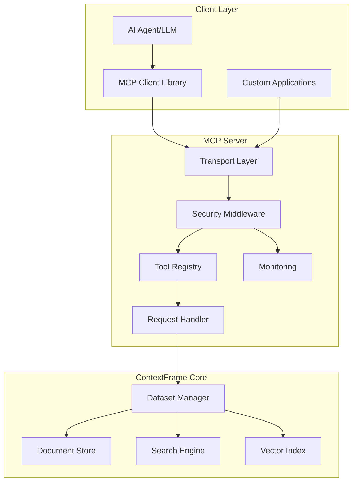
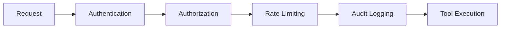
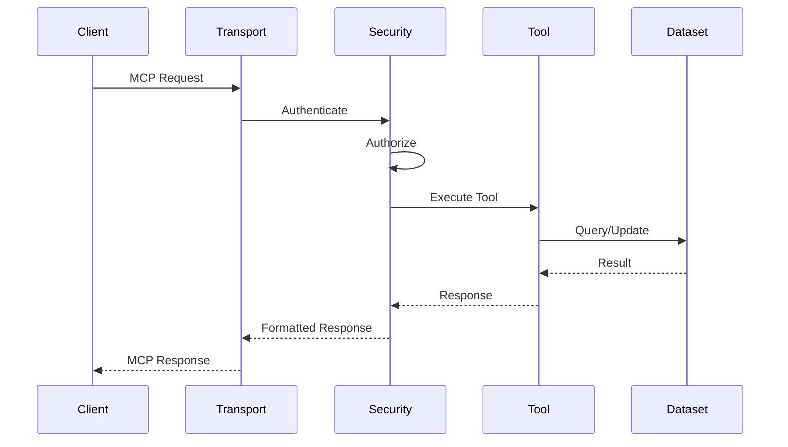

# Core Concepts

Understanding the fundamental concepts of the ContextFrame MCP server will help you build more effective integrations and use the system to its full potential.

## Model Context Protocol (MCP)

### What is MCP?

The Model Context Protocol is an open standard for enabling Large Language Models (LLMs) to interact with external systems in a structured, secure way. Think of it as a "USB interface" for AI - a standardized way to plug different tools and data sources into any AI system.

### Key Principles

1. **Tool-Based Interface**: All functionality exposed as discrete tools with well-defined inputs/outputs
2. **Transport Agnostic**: Works over HTTP, stdio, or other transports
3. **Security First**: Built-in authentication, authorization, and rate limiting
4. **Stateless Operations**: Each request is independent for easy scaling

## Architecture Overview



## Core Components

### 1. Transport Layer

The transport layer handles communication between clients and the MCP server:

- **HTTP Transport** (Primary): RESTful API with JSON payloads
- **Stdio Transport**: Direct process communication for local integrations
- **SSE Streaming**: Server-sent events for real-time updates

Example HTTP request:
```json
POST /mcp/v1/tools/search_documents
{
  "params": {
    "query": "machine learning",
    "limit": 10
  }
}
```

### 2. Tool System

Tools are the fundamental unit of functionality in MCP:

```python
# Tool definition structure
{
  "name": "search_documents",
  "description": "Search for documents using text or semantic search",
  "input_schema": {
    "type": "object",
    "properties": {
      "query": {"type": "string"},
      "limit": {"type": "integer", "default": 10}
    },
    "required": ["query"]
  }
}
```

Tool categories in ContextFrame:
- **Document Operations**: CRUD operations on documents
- **Search Tools**: Text, vector, and hybrid search
- **Collection Management**: Organize documents
- **Analytics**: Statistics and insights
- **Import/Export**: Bulk data operations
- **System Tools**: Health, monitoring, configuration

### 3. Security Model

Multi-layered security approach:



- **Authentication**: Verify who is making the request
- **Authorization**: Check if they can perform the action
- **Rate Limiting**: Prevent abuse and ensure fair usage
- **Audit Logging**: Track all operations for compliance

### 4. Dataset Management

ContextFrame uses Lance format for storage:

```
dataset.lance/
├── _metadata/
│   ├── schema.json
│   └── manifest.json
├── data/
│   ├── 0.parquet
│   ├── 1.parquet
│   └── ...
└── _indices/
    ├── vector_index/
    └── text_index/
```

Key features:
- **Columnar Storage**: Efficient for analytics
- **Version Control**: Track dataset changes
- **Zero-Copy Reads**: Memory-mapped for performance
- **Cloud Native**: Works with S3, GCS, Azure

## Data Model

### Documents

The fundamental unit of data:

```json
{
  "id": "doc_abc123",
  "content": "Document content...",
  "metadata": {
    "title": "Document Title",
    "created_at": "2024-01-01T00:00:00Z",
    "tags": ["topic1", "topic2"],
    "custom_field": "value"
  },
  "embeddings": [0.1, 0.2, ...],  // Optional vector
  "dataset_id": "main",
  "collection_id": "research"  // Optional
}
```

### Collections

Logical groupings of documents:

```json
{
  "id": "coll_research",
  "name": "Research Papers",
  "description": "Academic research collection",
  "metadata": {
    "department": "AI Lab",
    "access_level": "public"
  },
  "document_count": 1523
}
```

### Relationships

Documents can have relationships:
- **Parent/Child**: Hierarchical structure
- **Related**: Semantic connections
- **References**: Citations or links

## Request Flow

Understanding how requests are processed:



## Key Patterns

### 1. Batch Operations

Efficient bulk processing:
```python
# Instead of multiple calls
for doc in documents:
    client.document_create(doc)

# Use batch operation
client.document_create_batch(documents)
```

### 2. Streaming Results

For large result sets:
```python
# Stream search results
stream = client.search_documents_stream(
    query="large dataset",
    chunk_size=100
)
for chunk in stream:
    process(chunk)
```

### 3. Transactional Updates

Atomic operations:
```python
# All succeed or all fail
with client.transaction() as tx:
    tx.document_update(id1, content1)
    tx.document_update(id2, content2)
    tx.collection_add_documents(coll_id, [id1, id2])
```

## Error Handling

MCP uses structured error responses:

```json
{
  "error": {
    "code": "RATE_LIMIT_EXCEEDED",
    "message": "Too many requests",
    "details": {
      "limit": 100,
      "window": "1h",
      "retry_after": 3600
    }
  }
}
```

Error categories:
- **Client Errors** (4xx): Invalid requests, auth failures
- **Server Errors** (5xx): Internal errors, temporary failures
- **MCP Errors**: Protocol-specific errors

## Performance Considerations

### Caching

Built-in caching for common operations:
- Search results cached for identical queries
- Collection metadata cached with TTL
- Document lookups use LRU cache

### Connection Pooling

HTTP transport uses connection pooling:
```python
# Reuse connections
client = MCPClient(
    "http://localhost:8000",
    pool_size=10,
    pool_timeout=30
)
```

### Pagination

Efficient handling of large results:
```python
# Paginated queries
results = client.search_documents(
    query="python",
    limit=50,
    offset=100
)
```

## Best Practices

1. **Use Appropriate Tools**: Choose the right tool for your use case
2. **Batch When Possible**: Reduce overhead with batch operations
3. **Handle Errors Gracefully**: Implement retry logic for transient failures
4. **Monitor Usage**: Track metrics to optimize performance
5. **Secure by Default**: Always use authentication in production

## Next Steps

- [API Reference](../api/tools.md) - Detailed tool documentation
- [Security Guide](../configuration/security.md) - Configure authentication
- [Integration Patterns](../guides/integration-patterns.md) - Common use cases
- [Performance Tuning](../guides/performance.md) - Optimization tips