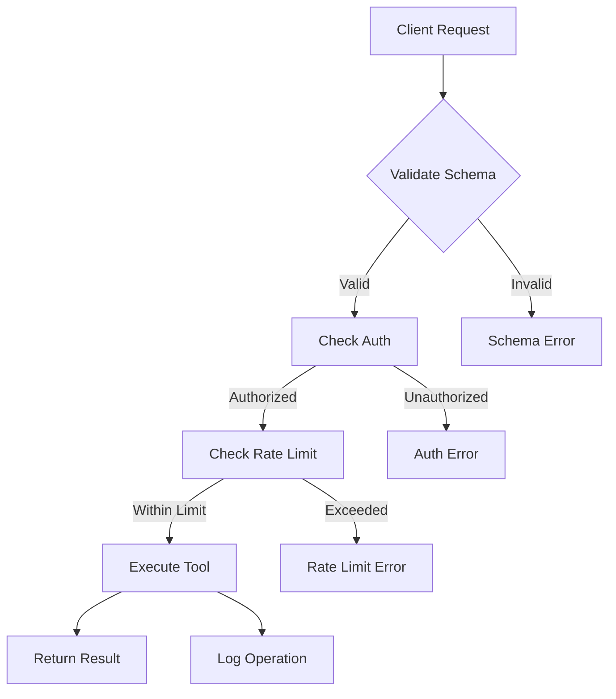

# Understanding MCP Tools

Tools are the fundamental building blocks of the MCP protocol. Each tool represents a specific capability that AI agents can use to interact with ContextFrame datasets.

## What is a Tool?

A tool in MCP is:
- A well-defined function with inputs and outputs
- Self-describing with JSON Schema
- Stateless and idempotent (where possible)
- Secured with authentication and authorization

Think of tools as API endpoints specifically designed for AI consumption.

## Tool Anatomy

Every MCP tool has the following structure:

```json
{
  "name": "search_documents",
  "description": "Search documents using text, vector, or hybrid search",
  "inputSchema": {
    "type": "object",
    "properties": {
      "query": {
        "type": "string",
        "description": "Search query text"
      },
      "search_type": {
        "type": "string",
        "enum": ["text", "vector", "hybrid"],
        "default": "hybrid"
      },
      "limit": {
        "type": "integer",
        "minimum": 1,
        "maximum": 100,
        "default": 10
      }
    },
    "required": ["query"]
  }
}
```

## Tool Categories

### 1. Document Operations

Core CRUD operations for documents:

| Tool | Purpose | Example Use |
|------|---------|-------------|
| `document_create` | Create new document | Adding research papers |
| `document_get` | Retrieve by ID | Fetching specific doc |
| `document_update` | Modify existing | Updating metadata |
| `document_delete` | Remove document | Cleanup operations |
| `document_exists` | Check existence | Validation logic |

### 2. Search Tools

Various search capabilities:

| Tool | Purpose | Search Type |
|------|---------|-------------|
| `search_documents` | General search | Text/Vector/Hybrid |
| `search_similar` | Find similar docs | Vector similarity |
| `search_by_metadata` | Filter by attributes | SQL-like queries |
| `search_within_collection` | Scoped search | Collection-specific |

### 3. Collection Management

Organize documents into groups:

| Tool | Purpose | Typical Use |
|------|---------|-------------|
| `collection_create` | New collection | Project organization |
| `collection_list` | List all | Discovery |
| `collection_add_documents` | Add to collection | Categorization |
| `collection_remove_documents` | Remove from | Reorganization |
| `collection_stats` | Get statistics | Analytics |

### 4. Analytics Tools

Insights and statistics:

| Tool | Purpose | Returns |
|------|---------|---------|
| `dataset_stats` | Overall statistics | Counts, size, etc |
| `search_analytics` | Search patterns | Popular queries |
| `usage_metrics` | Usage tracking | API calls, costs |
| `document_analytics` | Document insights | Relationships, clusters |

### 5. Import/Export Tools

Bulk data operations:

| Tool | Purpose | Formats |
|------|---------|---------|
| `import_documents` | Bulk import | JSON, CSV, Parquet |
| `export_documents` | Bulk export | Multiple formats |
| `import_from_url` | Remote import | Web sources |
| `export_to_cloud` | Cloud export | S3, GCS, Azure |

### 6. System Tools

Management and monitoring:

| Tool | Purpose | Usage |
|------|---------|-------|
| `health_check` | Server status | Monitoring |
| `list_tools` | Available tools | Discovery |
| `validate_dataset` | Check integrity | Maintenance |
| `clear_cache` | Cache management | Performance |

## Tool Execution Flow



## Tool Patterns

### 1. Idempotent Operations

Many tools are idempotent - calling them multiple times has the same effect:

```python
# Creating with explicit ID is idempotent
client.document_create(
    id="doc_123",
    content="...",
    upsert=True  # Create or update
)
```

### 2. Batch Operations

Tools that support batch processing:

```python
# Single operation
for doc in documents:
    client.document_create(doc)

# Batch operation (more efficient)
client.document_create_batch(documents)
```

### 3. Streaming Results

Tools that can stream large results:

```python
# Regular search (all results at once)
results = client.search_documents(query="AI", limit=1000)

# Streaming search (memory efficient)
for batch in client.search_documents_stream(query="AI", batch_size=100):
    process_batch(batch)
```

### 4. Transactional Tools

Some tools support transactions:

```python
# Atomic operations
with client.transaction() as tx:
    doc_id = tx.document_create(content="...")
    tx.collection_add_documents("research", [doc_id])
    # All operations succeed or all fail
```

## Input Validation

All tool inputs are validated against their schema:

```python
# This will fail validation
client.search_documents(
    query="test",
    limit=1000  # Max is 100
)
# Error: Invalid input: limit must be <= 100

# Proper usage
client.search_documents(
    query="test",
    limit=100  # Within bounds
)
```

## Output Formats

Tools return structured responses:

```json
{
  "result": {
    "documents": [...],
    "total_count": 156,
    "execution_time_ms": 23
  },
  "metadata": {
    "tool": "search_documents",
    "version": "1.0",
    "cached": false
  }
}
```

## Error Handling

Tools provide detailed error information:

```json
{
  "error": {
    "type": "ToolExecutionError",
    "tool": "document_create",
    "code": "DUPLICATE_ID",
    "message": "Document with ID 'doc_123' already exists",
    "suggestion": "Use upsert=true to update existing document"
  }
}
```

## Tool Discovery

Clients can discover available tools:

```python
# List all tools
tools = client.list_tools()

# Get specific tool info
tool_info = client.get_tool_info("search_documents")
print(tool_info["description"])
print(tool_info["inputSchema"])
```

## Custom Tools

While ContextFrame provides 43 built-in tools, you can extend with custom tools:

```python
@mcp_tool(
    name="summarize_collection",
    description="Generate summary of all documents in a collection"
)
def summarize_collection(collection_id: str, max_length: int = 500):
    # Custom implementation
    documents = get_collection_documents(collection_id)
    return generate_summary(documents, max_length)
```

## Tool Composition

Tools can be composed for complex operations:

```python
# Find and export related documents
def export_related_documents(doc_id: str, output_path: str):
    # 1. Get the document
    doc = client.document_get(doc_id)
    
    # 2. Find similar documents
    similar = client.search_similar(
        document_id=doc_id,
        limit=50
    )
    
    # 3. Export all to file
    doc_ids = [doc_id] + [d["id"] for d in similar]
    client.export_documents(
        document_ids=doc_ids,
        format="json",
        output_path=output_path
    )
```

## Performance Tips

### 1. Use Appropriate Tools

Choose the most specific tool for your needs:
```python
# Less efficient
all_docs = client.document_list()
filtered = [d for d in all_docs if d["metadata"]["type"] == "paper"]

# More efficient
filtered = client.search_by_metadata(
    filters={"type": "paper"}
)
```

### 2. Leverage Caching

Some tools cache results:
```python
# First call: hits the database
results1 = client.collection_stats("research")

# Second call within TTL: returns cached
results2 = client.collection_stats("research")
```

### 3. Batch When Possible

Reduce overhead:
```python
# Instead of 100 API calls
for id in document_ids:
    client.document_delete(id)

# Make 1 API call
client.document_delete_batch(document_ids)
```

## Security Considerations

Tools respect security boundaries:

1. **Authentication**: Every tool requires valid credentials
2. **Authorization**: Tools check permissions before execution
3. **Rate Limiting**: Prevents abuse and ensures fair usage
4. **Audit Logging**: All tool executions are logged

## Best Practices

1. **Read Tool Documentation**: Understand inputs, outputs, and limitations
2. **Handle Errors**: Implement proper error handling
3. **Use Batch Operations**: When processing multiple items
4. **Monitor Usage**: Track tool execution metrics
5. **Cache Results**: When appropriate for your use case

## Next Steps

- [API Reference](../api/tools.md) - Detailed documentation for each tool
- [Security Configuration](../configuration/security.md) - Set up tool permissions
- [Integration Examples](../cookbook/index.md) - Real-world tool usage
- [Performance Guide](../guides/performance.md) - Optimize tool usage