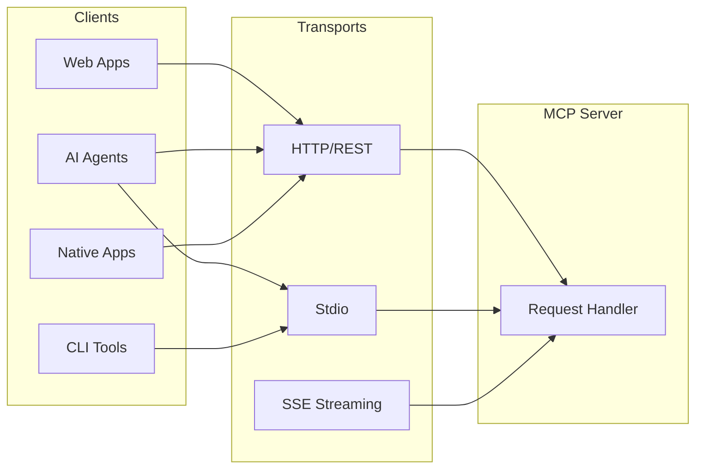

# Transport Layers

The ContextFrame MCP server supports multiple transport mechanisms to accommodate different deployment scenarios and integration patterns. This guide explains each transport option and when to use them.

## Transport Overview



## HTTP Transport (Primary)

HTTP is the recommended transport for most use cases, providing a RESTful API interface.

### Features

- **Universal Compatibility**: Works with any HTTP client
- **Stateless Design**: Easy to scale horizontally
- **Standard Security**: TLS, authentication headers
- **Load Balancing**: Works with standard infrastructure
- **Firewall Friendly**: Uses standard ports

### Configuration

```yaml
transport:
  type: http
  config:
    host: 0.0.0.0
    port: 8000
    cors:
      enabled: true
      origins: ["*"]
    ssl:
      enabled: true
      cert_file: /path/to/cert.pem
      key_file: /path/to/key.pem
```

### Request Format

```http
POST /mcp/v1/tools/search_documents HTTP/1.1
Host: api.contextframe.com
Content-Type: application/json
Authorization: Bearer your-api-key

{
  "params": {
    "query": "machine learning",
    "limit": 10
  }
}
```

### Response Format

```http
HTTP/1.1 200 OK
Content-Type: application/json

{
  "result": {
    "documents": [...],
    "total_count": 42
  },
  "metadata": {
    "execution_time_ms": 15
  }
}
```

### When to Use HTTP

- **Production deployments**: Best for scalable, secure deployments
- **Multi-tenant systems**: Easy to isolate tenants
- **Cloud environments**: Works with load balancers, API gateways
- **Remote access**: Accessible over the internet
- **Monitoring**: Integrates with standard tools

## Stdio Transport

Stdio (standard input/output) transport enables direct process communication, ideal for local integrations.

### Features

- **Zero Network Overhead**: Direct process communication
- **Simple Integration**: No network configuration needed
- **Secure by Default**: No network exposure
- **Low Latency**: Minimal overhead

### Configuration

```yaml
transport:
  type: stdio
  config:
    buffer_size: 8192
    timeout_ms: 30000
```

### Starting Stdio Mode

```bash
# Basic stdio mode
contextframe-mcp stdio

# With specific dataset
contextframe-mcp stdio --dataset-path /data/my-dataset.lance

# With configuration
contextframe-mcp stdio --config mcp-config.yaml
```

### Message Format

Input (stdin):
```json
{
  "jsonrpc": "2.0",
  "method": "tools/search_documents",
  "params": {
    "query": "quantum computing",
    "limit": 5
  },
  "id": 1
}
```

Output (stdout):
```json
{
  "jsonrpc": "2.0",
  "result": {
    "documents": [...],
    "total_count": 12
  },
  "id": 1
}
```

### Integration Example

```python
import subprocess
import json

# Start MCP server in stdio mode
proc = subprocess.Popen(
    ["contextframe-mcp", "stdio"],
    stdin=subprocess.PIPE,
    stdout=subprocess.PIPE,
    stderr=subprocess.PIPE,
    text=True
)

# Send request
request = {
    "jsonrpc": "2.0",
    "method": "tools/document_create",
    "params": {
        "content": "Hello, World!",
        "metadata": {"type": "greeting"}
    },
    "id": 1
}

proc.stdin.write(json.dumps(request) + "\n")
proc.stdin.flush()

# Read response
response = json.loads(proc.stdout.readline())
print(response["result"])
```

### When to Use Stdio

- **Local AI agents**: Claude Desktop, local LLMs
- **Development**: Quick testing without network setup
- **Embedded systems**: Minimal resource usage
- **Security-critical**: No network exposure
- **Single-user apps**: Desktop applications

## SSE Streaming Transport

Server-Sent Events enable real-time streaming of results, useful for long-running operations.

### Features

- **Real-time Updates**: Stream results as they're generated
- **Resumable**: Client can reconnect and resume
- **Efficient**: Lower overhead than polling
- **Standard Protocol**: Works with EventSource API

### Configuration

```yaml
transport:
  sse:
    enabled: true
    endpoint: /mcp/v1/stream
    heartbeat_interval: 30
    max_connections: 1000
```

### Client Example

```javascript
const eventSource = new EventSource('/mcp/v1/stream/search?query=AI');

eventSource.onmessage = (event) => {
  const result = JSON.parse(event.data);
  console.log('Received:', result);
};

eventSource.onerror = (error) => {
  console.error('Stream error:', error);
};
```

### Stream Format

```
event: document
data: {"id": "doc_123", "content": "...", "score": 0.95}

event: document
data: {"id": "doc_124", "content": "...", "score": 0.92}

event: complete
data: {"total_count": 150, "execution_time_ms": 234}
```

### When to Use SSE

- **Large result sets**: Stream results as they're found
- **Real-time monitoring**: Live metrics and updates
- **Progress tracking**: Long-running operations
- **Incremental results**: Show results as available

## Transport Selection Guide

| Use Case | Recommended Transport | Why |
|----------|---------------------|-----|
| Production API | HTTP | Scalable, secure, standard |
| Claude Desktop | Stdio | Direct integration |
| Web Application | HTTP | Browser compatible |
| Batch Processing | HTTP | Better error handling |
| Real-time Dashboard | SSE | Live updates |
| Embedded System | Stdio | Minimal resources |
| Microservices | HTTP | Service mesh compatible |

## Security Considerations

### HTTP Security

```yaml
security:
  http:
    tls:
      enabled: true
      min_version: "1.2"
    headers:
      - "X-API-Key"
      - "Authorization"
    cors:
      allowed_origins: ["https://app.example.com"]
      allowed_methods: ["POST", "GET"]
```

### Stdio Security

- Process isolation
- User permissions
- No network exposure
- Audit via process monitoring

### SSE Security

- Same-origin policy
- Authentication tokens
- Connection limits
- Rate limiting

## Performance Comparison

| Transport | Latency | Throughput | CPU Usage | Memory |
|-----------|---------|------------|-----------|---------|
| HTTP | ~1-5ms | High | Moderate | Moderate |
| Stdio | <1ms | Very High | Low | Low |
| SSE | ~1-2ms | Moderate | Low | Low |

## Advanced Configuration

### HTTP with Connection Pooling

```python
from contextframe.mcp import MCPClient

client = MCPClient(
    base_url="http://localhost:8000",
    transport_config={
        "pool_connections": 10,
        "pool_maxsize": 50,
        "max_retries": 3,
        "timeout": 30
    }
)
```

### Stdio with Custom Protocol

```python
class CustomStdioTransport(StdioTransport):
    def encode_message(self, message):
        # Custom encoding
        return msgpack.packb(message)
    
    def decode_message(self, data):
        # Custom decoding
        return msgpack.unpackb(data)
```

### SSE with Reconnection

```javascript
class ReconnectingEventSource {
  constructor(url, options = {}) {
    this.url = url;
    this.reconnectInterval = options.reconnectInterval || 3000;
    this.connect();
  }
  
  connect() {
    this.eventSource = new EventSource(this.url);
    
    this.eventSource.onerror = () => {
      this.eventSource.close();
      setTimeout(() => this.connect(), this.reconnectInterval);
    };
  }
}
```

## Monitoring Transport Health

### HTTP Metrics

```python
# Prometheus metrics
mcp_http_requests_total
mcp_http_request_duration_seconds
mcp_http_request_size_bytes
mcp_http_response_size_bytes
```

### Stdio Metrics

```python
# Process metrics
mcp_stdio_messages_total
mcp_stdio_message_size_bytes
mcp_stdio_processing_time_seconds
```

### SSE Metrics

```python
# Streaming metrics
mcp_sse_connections_active
mcp_sse_messages_sent_total
mcp_sse_connection_duration_seconds
```

## Troubleshooting

### HTTP Issues

```bash
# Test connectivity
curl -X GET http://localhost:8000/health

# Check TLS
openssl s_client -connect api.contextframe.com:443

# Debug headers
curl -v -X POST http://localhost:8000/mcp/v1/tools/list_tools
```

### Stdio Issues

```bash
# Test stdio mode
echo '{"jsonrpc":"2.0","method":"health_check","id":1}' | contextframe-mcp stdio

# Check process
ps aux | grep contextframe-mcp

# Monitor I/O
strace -e read,write contextframe-mcp stdio
```

### SSE Issues

```javascript
// Debug SSE connection
const eventSource = new EventSource('/mcp/v1/stream/test');

eventSource.addEventListener('open', () => {
  console.log('Connection opened');
});

eventSource.addEventListener('error', (e) => {
  console.log('Connection error:', e);
});
```

## Best Practices

1. **Choose the Right Transport**: Match transport to use case
2. **Implement Retry Logic**: Handle transient failures
3. **Monitor Performance**: Track latency and throughput
4. **Secure All Transports**: Even stdio needs access control
5. **Test Failover**: Ensure graceful degradation

## Next Steps

- [HTTP API Reference](../api/http.md) - Detailed HTTP endpoints
- [Stdio Protocol](../reference/stdio-protocol.md) - Message format spec
- [SSE Integration](../guides/sse-streaming.md) - Streaming guide
- [Security Configuration](../configuration/security.md) - Secure your transport