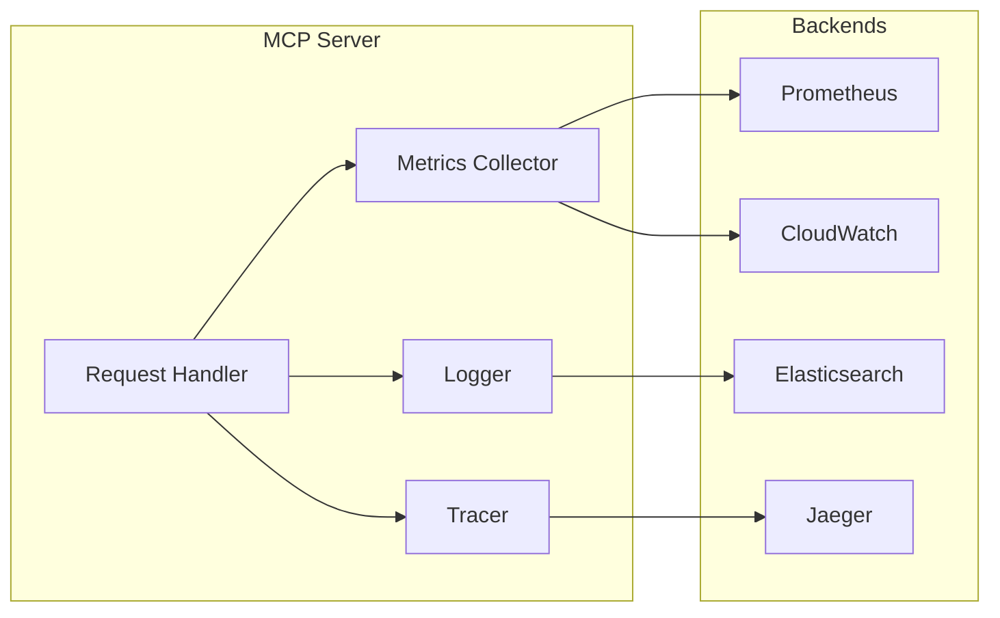

# Monitoring Setup Guide

Comprehensive monitoring is essential for operating the ContextFrame MCP server in production. This guide covers logging, metrics, tracing, and alerting configuration.

## Monitoring Overview

The MCP server provides built-in monitoring capabilities with minimal overhead:



## Logging Configuration

### Basic Logging

```yaml
monitoring:
  logging:
    level: INFO                      # DEBUG, INFO, WARNING, ERROR
    format: json                     # json, text, structured
    
    # Console output
    console:
      enabled: true
      colorize: true                 # Color coding for levels
      
    # File output
    file:
      enabled: true
      path: /var/log/contextframe/mcp.log
      rotation:
        type: size                   # size, time, both
        max_size: 100MB
        max_files: 10
        compress: true
```

### Structured Logging

JSON format for easy parsing:

```json
{
  "timestamp": "2024-01-15T10:30:45.123Z",
  "level": "INFO",
  "message": "Document created successfully",
  "fields": {
    "request_id": "req_abc123",
    "user_id": "user_456",
    "tool": "document_create",
    "document_id": "doc_789",
    "duration_ms": 45
  },
  "context": {
    "service": "mcp-server",
    "version": "0.1.0",
    "environment": "production"
  }
}
```

### Log Levels and Categories

```yaml
monitoring:
  logging:
    # Global level
    level: INFO
    
    # Per-component levels
    levels:
      contextframe.mcp.server: INFO
      contextframe.mcp.auth: DEBUG
      contextframe.mcp.tools: INFO
      contextframe.lance: WARNING
      
    # Categories to include/exclude
    categories:
      include:
        - security
        - performance
        - errors
      exclude:
        - health_checks
        - metrics_export
```

### Log Aggregation

Send logs to centralized systems:

```yaml
monitoring:
  logging:
    aggregation:
      # Elasticsearch/ELK
      elasticsearch:
        enabled: true
        hosts:
          - http://elasticsearch:9200
        index: contextframe-mcp
        
      # AWS CloudWatch
      cloudwatch:
        enabled: true
        region: us-east-1
        log_group: /aws/contextframe/mcp
        
      # Splunk
      splunk:
        enabled: true
        endpoint: https://splunk.example.com:8088
        token: ${SPLUNK_HEC_TOKEN}
        
      # Fluentd/Fluent Bit
      fluentd:
        enabled: true
        host: fluentd
        port: 24224
```

## Metrics Collection

### Prometheus Metrics

Built-in Prometheus integration:

```yaml
monitoring:
  metrics:
    enabled: true
    backend: prometheus
    
    # Metrics endpoint
    endpoint:
      path: /metrics
      port: 9090                     # Separate port for metrics
      auth: false                    # No auth for scraping
      
    # What to collect
    collectors:
      - request_duration
      - request_size
      - response_size
      - active_connections
      - tool_usage
      - error_rates
      - cache_hits
      - dataset_operations
      
    # Custom labels
    labels:
      service: mcp-server
      environment: ${ENVIRONMENT}
      region: ${AWS_REGION}
```

### Available Metrics

Core metrics exposed:

```prometheus
# HTTP Metrics
mcp_http_requests_total{method="POST",endpoint="/mcp/v1/tools/search_documents",status="200"}
mcp_http_request_duration_seconds{quantile="0.99"}
mcp_http_request_size_bytes_sum
mcp_http_response_size_bytes_sum

# Tool Metrics
mcp_tool_executions_total{tool="search_documents",status="success"}
mcp_tool_duration_seconds{tool="search_documents",quantile="0.95"}
mcp_tool_errors_total{tool="document_create",error="validation_failed"}

# Dataset Metrics
mcp_dataset_documents_total
mcp_dataset_size_bytes
mcp_dataset_operations_total{operation="read"}

# Search Metrics
mcp_search_queries_total{type="hybrid"}
mcp_search_latency_seconds{type="vector",quantile="0.99"}
mcp_search_results_returned_total

# Cache Metrics
mcp_cache_hits_total{cache="document"}
mcp_cache_misses_total{cache="search"}
mcp_cache_evictions_total

# System Metrics
mcp_active_connections
mcp_memory_usage_bytes
mcp_cpu_usage_percent
```

### StatsD Integration

For existing StatsD infrastructure:

```yaml
monitoring:
  metrics:
    backend: statsd
    statsd:
      host: statsd.example.com
      port: 8125
      prefix: contextframe.mcp
      
      # Metric types
      timers:
        - request_duration
        - tool_execution_time
      counters:
        - requests_total
        - errors_total
      gauges:
        - active_connections
        - queue_size
```

### Custom Metrics

Define application-specific metrics:

```yaml
monitoring:
  metrics:
    custom:
      # Document complexity metric
      - name: document_complexity_score
        type: histogram
        buckets: [0.1, 0.5, 1.0, 2.0, 5.0]
        labels: ["collection", "type"]
        
      # Cost tracking
      - name: operation_cost_units
        type: counter
        labels: ["tool", "user", "tenant"]
        
      # SLA tracking
      - name: sla_compliance_rate
        type: gauge
        labels: ["service_level", "customer"]
```

## Distributed Tracing

### OpenTelemetry Setup

```yaml
monitoring:
  tracing:
    enabled: true
    backend: opentelemetry
    
    # OTLP Exporter
    otlp:
      endpoint: http://otel-collector:4317
      protocol: grpc                 # grpc or http
      
    # Sampling
    sampling:
      type: probability              # probability, rate_limiting
      rate: 0.1                      # 10% sampling
      
    # Trace enrichment
    attributes:
      service.name: mcp-server
      service.version: ${VERSION}
      deployment.environment: ${ENVIRONMENT}
```

### Jaeger Integration

```yaml
monitoring:
  tracing:
    backend: jaeger
    jaeger:
      agent_host: jaeger-agent
      agent_port: 6831
      
      # Or collector endpoint
      collector_endpoint: http://jaeger:14268/api/traces
      
      # Service name
      service_name: contextframe-mcp
      
      # Tags
      tags:
        environment: production
        region: us-east-1
```

### Trace Context

Automatic trace context propagation:

```yaml
monitoring:
  tracing:
    propagation:
      # Formats to accept/inject
      formats:
        - tracecontext              # W3C Trace Context
        - baggage                   # W3C Baggage
        - b3                        # Zipkin B3
        - jaeger                    # Uber Jaeger
        
    # What to trace
    instrumentation:
      - http_server
      - http_client
      - database
      - cache
      - tools
```

## Health Checks

### Basic Health Endpoint

```yaml
monitoring:
  health:
    enabled: true
    endpoint: /health
    
    # Checks to perform
    checks:
      # Dataset connectivity
      dataset:
        enabled: true
        timeout: 5s
        
      # Memory usage
      memory:
        enabled: true
        threshold: 90               # Percent
        
      # Disk space
      disk:
        enabled: true
        threshold: 85               # Percent
        path: /data
        
      # Custom checks
      custom:
        - name: embedding_service
          type: http
          url: http://embeddings:8080/health
          timeout: 2s
```

### Health Response Format

```json
{
  "status": "healthy",              // healthy, degraded, unhealthy
  "timestamp": "2024-01-15T10:30:00Z",
  "version": "0.1.0",
  "checks": {
    "dataset": {
      "status": "healthy",
      "message": "Connected to dataset",
      "duration_ms": 5
    },
    "memory": {
      "status": "healthy",
      "usage_percent": 65,
      "available_mb": 3584
    },
    "disk": {
      "status": "warning",
      "usage_percent": 82,
      "available_gb": 45
    }
  }
}
```

### Readiness vs Liveness

```yaml
monitoring:
  health:
    # Liveness - is the service running?
    liveness:
      endpoint: /health/live
      checks: [process, memory]
      
    # Readiness - can it serve traffic?
    readiness:
      endpoint: /health/ready
      checks: [dataset, cache, auth]
      
    # Startup - initial startup check
    startup:
      endpoint: /health/startup
      initial_delay: 10s
      period: 5s
      failure_threshold: 3
```

## Performance Monitoring

### Request Performance

```yaml
monitoring:
  performance:
    # Track slow requests
    slow_requests:
      enabled: true
      threshold_ms: 1000
      log_details: true
      
    # Request profiling
    profiling:
      enabled: false                # Enable for debugging
      sample_rate: 0.01             # 1% of requests
      
    # Performance budgets
    budgets:
      search_documents:
        p50: 50ms
        p95: 200ms
        p99: 500ms
      document_create:
        p50: 100ms
        p95: 300ms
        p99: 1000ms
```

### Resource Monitoring

```yaml
monitoring:
  resources:
    # CPU monitoring
    cpu:
      enabled: true
      alert_threshold: 80           # Percent
      
    # Memory monitoring
    memory:
      enabled: true
      alert_threshold: 85           # Percent
      track_allocations: false      # Detailed tracking
      
    # Connection pools
    connections:
      track_pools: true
      alert_on_exhaustion: true
      
    # Thread pools
    threads:
      track_usage: true
      dump_on_deadlock: true
```

## Alerting Configuration

### Alert Rules

```yaml
monitoring:
  alerting:
    enabled: true
    
    # Alert destinations
    destinations:
      - type: webhook
        url: https://alerts.example.com/webhook
        
      - type: email
        smtp_host: smtp.example.com
        recipients:
          - ops@example.com
          
      - type: pagerduty
        integration_key: ${PAGERDUTY_KEY}
        
    # Alert rules
    rules:
      # High error rate
      - name: high_error_rate
        condition: |
          rate(mcp_tool_errors_total[5m]) > 0.05
        severity: warning
        notify: [email]
        
      # Service down
      - name: service_down
        condition: |
          up{job="mcp-server"} == 0
        severity: critical
        notify: [pagerduty]
        
      # Slow response times
      - name: slow_responses
        condition: |
          histogram_quantile(0.95, mcp_http_request_duration_seconds) > 1.0
        severity: warning
        notify: [webhook]
```

### Alert Aggregation

```yaml
monitoring:
  alerting:
    aggregation:
      # Group related alerts
      grouping:
        - by: [service, environment]
          wait: 30s
          interval: 5m
          
      # Silence rules
      silences:
        - name: maintenance_window
          schedule: "0 2 * * SUN"   # Sunday 2 AM
          duration: 2h
          
      # Deduplication
      deduplication:
        enabled: true
        window: 5m
```

## Dashboard Configuration

### Grafana Integration

```yaml
monitoring:
  dashboards:
    grafana:
      # Auto-provisioning
      provisioning:
        enabled: true
        folder: ContextFrame
        
      # Pre-built dashboards
      dashboards:
        - name: mcp-overview
          uid: contextframe-mcp-overview
          
        - name: mcp-performance
          uid: contextframe-mcp-performance
          
        - name: mcp-security
          uid: contextframe-mcp-security
```

### Key Metrics to Display

1. **Overview Dashboard**
   - Request rate
   - Error rate
   - Response time (p50, p95, p99)
   - Active users
   - Document count

2. **Performance Dashboard**
   - Tool execution times
   - Cache hit rates
   - Queue depths
   - Resource utilization
   - Slow query log

3. **Security Dashboard**
   - Authentication attempts
   - Failed authentications
   - Rate limit violations
   - Suspicious activity
   - Audit trail

## Cost Monitoring

### Usage Tracking

```yaml
monitoring:
  cost:
    enabled: true
    
    # Track costs per operation
    operations:
      document_create:
        cost: 0.001               # $ per operation
      search_documents:
        cost: 0.002
      vector_search:
        cost: 0.005
        
    # Track by dimensions
    dimensions:
      - user
      - tenant
      - tool
      - collection
      
    # Billing integration
    billing:
      provider: stripe
      export_interval: daily
```

## Monitoring Best Practices

### Development

```yaml
# config/development.yaml
monitoring:
  logging:
    level: DEBUG
    format: text
    console:
      enabled: true
      colorize: true
  metrics:
    enabled: true
    endpoint:
      auth: false
```

### Production

```yaml
# config/production.yaml
monitoring:
  logging:
    level: INFO
    format: json
    aggregation:
      elasticsearch:
        enabled: true
  metrics:
    enabled: true
    backend: prometheus
  tracing:
    enabled: true
    sampling:
      rate: 0.1
  alerting:
    enabled: true
```

### Monitoring Checklist

- [ ] Configure structured logging
- [ ] Set appropriate log levels
- [ ] Enable metrics collection
- [ ] Set up distributed tracing
- [ ] Configure health checks
- [ ] Define alert rules
- [ ] Create dashboards
- [ ] Set up log aggregation
- [ ] Configure cost tracking
- [ ] Test alert delivery
- [ ] Document runbooks
- [ ] Regular review cycles

## Troubleshooting

### Missing Metrics

```bash
# Check metrics endpoint
curl http://localhost:9090/metrics | grep mcp_

# Verify Prometheus scraping
curl http://prometheus:9090/api/v1/targets

# Check metric labels
curl http://localhost:9090/metrics | grep -A5 "HELP mcp_"
```

### Log Issues

```bash
# Check log output
tail -f /var/log/contextframe/mcp.log

# Verify log format
jq . /var/log/contextframe/mcp.log

# Test log aggregation
echo '{"test": "message"}' | nc fluentd 24224
```

### Trace Problems

```bash
# Check trace export
curl http://jaeger:16686/api/traces?service=mcp-server

# Verify sampling
grep "trace_id" /var/log/contextframe/mcp.log

# Test trace propagation
curl -H "traceparent: 00-abcd1234abcd1234abcd1234abcd1234-1234abcd1234abcd-01" \
  http://localhost:8000/health
```

## Next Steps

- [Production Deployment](../guides/production-deployment.md) - Production monitoring setup
- [Performance Tuning](../guides/performance.md) - Optimize based on metrics
- [Troubleshooting Guide](../guides/troubleshooting.md) - Common issues
- [Runbook Templates](../reference/runbooks.md) - Operational procedures