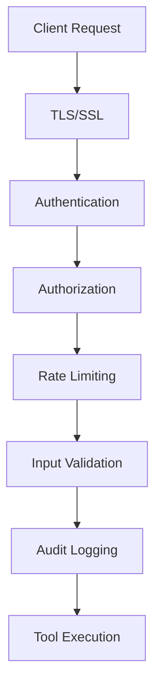

# Security Configuration Guide

This comprehensive guide covers all security aspects of the ContextFrame MCP server, from basic authentication to advanced authorization and audit logging.

## Security Overview

The MCP server implements defense-in-depth with multiple security layers:



## Authentication

### API Key Authentication

The simplest authentication method:

```yaml
security:
  auth:
    type: api_key
    api_key:
      header: X-API-Key      # Header name
      keys:
        - ${API_KEY_1}       # Environment variable
        - ${API_KEY_2}
      hash_keys: true        # Store hashed keys
```

Usage:
```bash
curl -H "X-API-Key: your-api-key" \
  http://localhost:8000/mcp/v1/tools/search_documents
```

### Bearer Token (JWT)

For stateless authentication:

```yaml
security:
  auth:
    type: bearer
    jwt:
      secret: ${JWT_SECRET}
      algorithm: HS256       # HS256, RS256, ES256
      issuer: contextframe
      audience: mcp-server
      expiry: 3600           # seconds
      
      # For RS256/ES256
      public_key_file: /path/to/public.pem
      private_key_file: /path/to/private.pem
```

Usage:
```bash
curl -H "Authorization: Bearer eyJhbGc..." \
  http://localhost:8000/mcp/v1/tools/search_documents
```

### OAuth 2.0 / OpenID Connect

For enterprise SSO integration:

```yaml
security:
  auth:
    type: oauth2
    oauth2:
      provider: generic      # generic, auth0, okta, azure-ad
      issuer: https://auth.example.com
      client_id: ${OAUTH_CLIENT_ID}
      client_secret: ${OAUTH_CLIENT_SECRET}
      redirect_uri: http://localhost:8000/auth/callback
      scopes:
        - openid
        - profile
        - email
      
      # Provider-specific
      azure_ad:
        tenant_id: ${AZURE_TENANT_ID}
      
      # Token validation
      validate_issuer: true
      validate_audience: true
      required_claims:
        - email_verified
```

### Multiple Authentication Methods

Support multiple auth methods simultaneously:

```yaml
security:
  auth:
    type: multiple
    methods:
      # API keys for service accounts
      - type: api_key
        header: X-Service-Key
        required_for:
          - /mcp/v1/admin/*
          
      # JWT for users
      - type: bearer
        jwt:
          secret: ${JWT_SECRET}
          
      # OAuth for web apps
      - type: oauth2
        oauth2:
          provider: auth0
          
    # Fallback order
    priority:
      - bearer
      - oauth2
      - api_key
```

### Custom Authentication

Implement custom authentication:

```yaml
security:
  auth:
    type: custom
    custom:
      module: contextframe.auth.custom
      class: LDAPAuthProvider
      config:
        server: ldap://corp.example.com
        base_dn: dc=example,dc=com
```

## Authorization

### Role-Based Access Control (RBAC)

Define roles and permissions:

```yaml
security:
  authorization:
    enabled: true
    type: rbac
    
    # Define roles
    roles:
      # Read-only access
      reader:
        description: "Read-only access to documents"
        permissions:
          - documents:read
          - collections:read
          - search:*
          
      # Write access
      writer:
        description: "Read and write documents"
        inherits: reader
        permissions:
          - documents:write
          - collections:write
          
      # Admin access
      admin:
        description: "Full administrative access"
        permissions:
          - "*"  # All permissions
          
    # User-role mapping
    users:
      alice@example.com:
        roles: [writer]
      bob@example.com:
        roles: [reader]
        
    # Group-role mapping
    groups:
      engineering:
        roles: [writer]
      contractors:
        roles: [reader]
        
    # Default role for new users
    default_role: reader
```

### Resource-Based Access Control

Fine-grained permissions per resource:

```yaml
security:
  authorization:
    type: resource
    
    # Resource policies
    policies:
      # Collection-level access
      - resource: collection:research-*
        effect: allow
        principals:
          - role:researcher
        actions:
          - read
          - write
          
      # Document-level access
      - resource: document:*
        effect: allow
        principals:
          - user:admin@example.com
        actions:
          - "*"
        conditions:
          - type: metadata
            field: classification
            operator: not_equals
            value: confidential
```

### Tool-Based Permissions

Control access to specific tools:

```yaml
security:
  authorization:
    tools:
      # Public tools
      public:
        - health_check
        - list_tools
        
      # Authenticated tools
      authenticated:
        - search_documents
        - document_get
        - collection_list
        
      # Restricted tools
      restricted:
        admin:
          - dataset_stats
          - usage_metrics
          - server_info
        writer:
          - document_create
          - document_update
          - document_delete
```

### Dynamic Authorization

Implement dynamic authorization rules:

```yaml
security:
  authorization:
    dynamic:
      provider: opa        # Open Policy Agent
      endpoint: http://opa:8181
      
      # Or custom provider
      custom:
        module: contextframe.auth.dynamic
        class: DynamicAuthProvider
        cache_ttl: 300     # seconds
```

## Rate Limiting

Prevent abuse and ensure fair usage:

```yaml
security:
  rate_limiting:
    enabled: true
    
    # Global limits
    global:
      requests: 1000
      window: 60           # seconds
      
    # Per-user limits
    user:
      requests: 100
      window: 60
      
    # Per-IP limits
    ip:
      requests: 50
      window: 60
      
    # Tool-specific limits
    tools:
      search_documents:
        requests: 50
        window: 60
        cost: 2            # Cost units
        
      document_create:
        requests: 20
        window: 60
        cost: 5
        
      import_documents:
        requests: 5
        window: 3600       # 1 hour
        cost: 100
        
    # Quota management
    quotas:
      enabled: true
      default_quota: 10000  # Monthly units
      
    # Burst handling
    burst:
      enabled: true
      multiplier: 2        # Allow 2x burst
      
    # Response headers
    headers:
      enabled: true
      prefix: X-RateLimit-
```

### Rate Limit Responses

```json
// Rate limit exceeded
{
  "error": {
    "code": "RATE_LIMIT_EXCEEDED",
    "message": "Too many requests",
    "details": {
      "limit": 100,
      "window": 60,
      "retry_after": 45,
      "quota_remaining": 500
    }
  }
}
```

## Audit Logging

Track all security-relevant events:

```yaml
security:
  audit:
    enabled: true
    
    # What to log
    events:
      - authentication.success
      - authentication.failure
      - authorization.denied
      - document.created
      - document.deleted
      - collection.modified
      - admin.action
      
    # Log detail level
    detail_level: full     # minimal, standard, full
    
    # Include request/response
    include_payload: true
    sanitize_sensitive: true
    
    # Storage backend
    storage:
      type: file           # file, database, siem
      file:
        path: /var/log/contextframe/audit.log
        rotation: daily
        retention: 90      # days
        format: json
        
      # Or database
      database:
        connection: postgresql://...
        table: audit_logs
        
      # Or SIEM
      siem:
        type: splunk       # splunk, elastic, datadog
        endpoint: https://splunk.example.com
        token: ${SPLUNK_TOKEN}
```

### Audit Log Format

```json
{
  "timestamp": "2024-01-15T10:30:00Z",
  "event_type": "document.created",
  "user": {
    "id": "user_123",
    "email": "alice@example.com",
    "ip": "192.168.1.100",
    "user_agent": "MCP Client/1.0"
  },
  "action": {
    "tool": "document_create",
    "parameters": {
      "collection_id": "research"
    }
  },
  "result": {
    "success": true,
    "document_id": "doc_456"
  },
  "metadata": {
    "request_id": "req_789",
    "session_id": "sess_012"
  }
}
```

## Input Validation

Protect against malicious input:

```yaml
security:
  validation:
    # Size limits
    limits:
      max_document_size: 10485760    # 10MB
      max_query_length: 1000
      max_metadata_size: 65536       # 64KB
      max_batch_size: 100
      
    # Content validation
    content:
      # Sanitize HTML/Scripts
      sanitize_html: true
      allowed_tags: []
      
      # File type restrictions
      allowed_content_types:
        - text/plain
        - text/markdown
        - application/json
        
    # Metadata validation
    metadata:
      max_keys: 50
      max_key_length: 100
      max_value_length: 1000
      
      # Reserved keys
      reserved_keys:
        - _id
        - _created
        - _updated
        
    # Query validation
    query:
      max_depth: 5           # Nested query depth
      disable_regex: false   # Disable regex queries
      allowed_operators:
        - equals
        - contains
        - greater_than
        - less_than
```

## Transport Security

### TLS/SSL Configuration

```yaml
security:
  tls:
    enabled: true
    
    # Certificates
    cert_file: /etc/ssl/certs/server.crt
    key_file: /etc/ssl/private/server.key
    ca_file: /etc/ssl/certs/ca-bundle.crt
    
    # Protocol settings
    min_version: "1.2"       # Minimum TLS version
    ciphers:
      - TLS_ECDHE_RSA_WITH_AES_256_GCM_SHA384
      - TLS_ECDHE_RSA_WITH_AES_128_GCM_SHA256
      
    # Client certificates
    client_auth:
      enabled: false
      required: false
      ca_file: /etc/ssl/certs/client-ca.crt
      
    # HSTS
    hsts:
      enabled: true
      max_age: 31536000      # 1 year
      include_subdomains: true
      preload: true
```

### CORS Configuration

```yaml
security:
  cors:
    enabled: true
    
    # Allowed origins
    origins:
      - https://app.example.com
      - https://*.example.com
      
    # Or allow credentials with specific origins
    allow_credentials: true
    origins:
      - https://trusted-app.com
      
    # Methods and headers
    methods: ["GET", "POST", "OPTIONS"]
    headers: ["Content-Type", "Authorization", "X-API-Key"]
    expose_headers: ["X-Request-ID", "X-RateLimit-*"]
    max_age: 3600
```

## Secrets Management

### Environment Variables

```yaml
security:
  secrets:
    # Reference environment variables
    api_key: ${API_KEY}
    jwt_secret: ${JWT_SECRET}
    
    # With defaults
    session_secret: ${SESSION_SECRET:-generated-default}
```

### External Secret Stores

```yaml
security:
  secrets:
    provider: vault          # vault, aws-secrets, azure-keyvault
    
    # HashiCorp Vault
    vault:
      address: https://vault.example.com
      token: ${VAULT_TOKEN}
      path: secret/contextframe/mcp
      
    # AWS Secrets Manager
    aws_secrets:
      region: us-east-1
      prefix: /contextframe/mcp/
      
    # Azure Key Vault
    azure_keyvault:
      vault_name: contextframe-kv
      tenant_id: ${AZURE_TENANT_ID}
```

### Secret Rotation

```yaml
security:
  secrets:
    rotation:
      enabled: true
      interval: 2592000      # 30 days
      
      # Graceful rotation
      overlap_period: 86400  # 24 hours
      
      # Notification
      notify:
        webhook: https://ops.example.com/secret-rotated
```

## Security Headers

Add security headers to responses:

```yaml
security:
  headers:
    # Security headers
    X-Content-Type-Options: nosniff
    X-Frame-Options: DENY
    X-XSS-Protection: "1; mode=block"
    Referrer-Policy: strict-origin-when-cross-origin
    
    # CSP
    Content-Security-Policy: "default-src 'self'; script-src 'self'"
    
    # Custom headers
    custom:
      X-Service-Version: ${VERSION}
```

## Security Monitoring

### Security Metrics

```yaml
monitoring:
  security:
    # Track security events
    metrics:
      - auth_attempts_total
      - auth_failures_total
      - rate_limit_hits_total
      - invalid_token_total
      
    # Alerts
    alerts:
      - name: high_auth_failures
        condition: rate(auth_failures_total[5m]) > 10
        severity: warning
        
      - name: suspected_attack
        condition: rate(rate_limit_hits_total[1m]) > 100
        severity: critical
```

### Security Scanning

```yaml
security:
  scanning:
    # Dependency scanning
    dependencies:
      enabled: true
      schedule: daily
      
    # Container scanning
    containers:
      enabled: true
      registry: registry.example.com
      
    # SAST/DAST
    code_analysis:
      enabled: true
      tools: ["semgrep", "bandit"]
```

## Best Practices

### Development

```yaml
# config/development.yaml
security:
  enabled: true              # Always test with security
  auth:
    type: api_key
    api_key:
      keys: ["dev-key-123"]
  audit:
    enabled: true
    detail_level: full
```

### Production

```yaml
# config/production.yaml
security:
  enabled: true
  auth:
    type: oauth2
    oauth2:
      provider: auth0
  tls:
    enabled: true
    min_version: "1.2"
  rate_limiting:
    enabled: true
  audit:
    enabled: true
    storage:
      type: siem
```

### Security Checklist

- [ ] Enable authentication
- [ ] Configure authorization rules
- [ ] Set up rate limiting
- [ ] Enable audit logging
- [ ] Configure TLS/SSL
- [ ] Implement input validation
- [ ] Set security headers
- [ ] Configure CORS properly
- [ ] Manage secrets securely
- [ ] Monitor security metrics
- [ ] Regular security updates
- [ ] Incident response plan

## Troubleshooting

### Authentication Issues

```bash
# Test authentication
curl -v -H "Authorization: Bearer $TOKEN" \
  http://localhost:8000/mcp/v1/tools/health_check

# Check JWT token
jwt decode $TOKEN

# Validate API key
contextframe-mcp validate-auth --key $API_KEY
```

### Authorization Issues

```bash
# Check user permissions
contextframe-mcp show-permissions --user alice@example.com

# Test authorization
contextframe-mcp test-auth --user alice@example.com --tool document_create
```

### Rate Limiting Issues

```bash
# Check rate limit status
curl -I http://localhost:8000/mcp/v1/tools/search_documents

# Response headers
X-RateLimit-Limit: 100
X-RateLimit-Remaining: 45
X-RateLimit-Reset: 1705320000
```

## Next Steps

- [Monitoring Setup](monitoring.md) - Configure logging and metrics
- [Production Deployment](../guides/production-deployment.md) - Security hardening
- [Compliance Guide](../guides/compliance.md) - Meet regulatory requirements
- [Incident Response](../guides/incident-response.md) - Security procedures