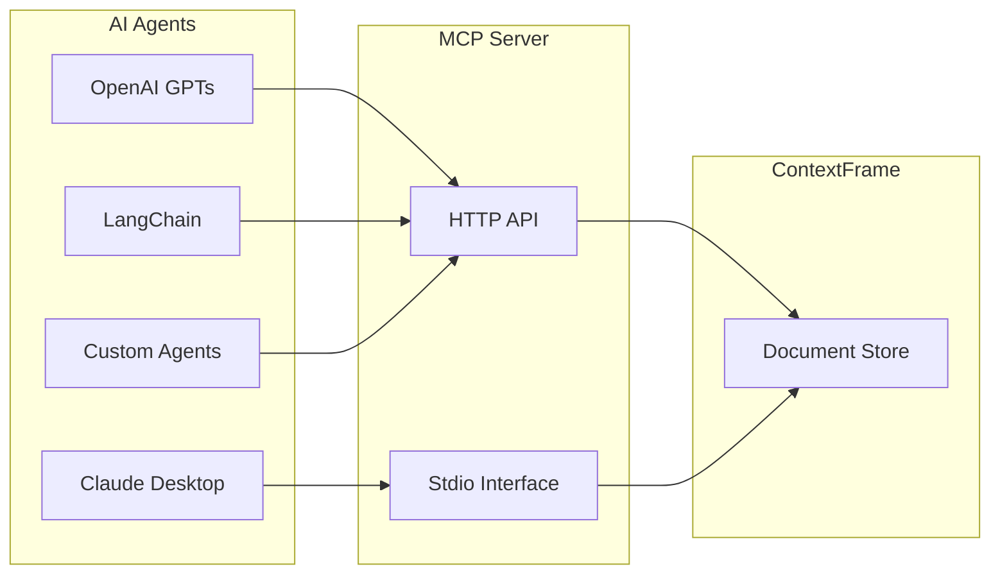

# AI Agent Integration Guide

This guide covers how to integrate various AI agents and language models with the ContextFrame MCP server. Whether you're using Claude, GPT, or custom agents, this guide will help you connect and configure your integration.

## Integration Overview



## Claude Desktop Integration

### Configuration

Add to your Claude Desktop configuration file:

**macOS**: `~/Library/Application Support/Claude/claude_desktop_config.json`
**Windows**: `%APPDATA%\Claude\claude_desktop_config.json`

```json
{
  "mcpServers": {
    "contextframe": {
      "command": "contextframe-mcp",
      "args": ["stdio"],
      "env": {
        "CONTEXTFRAME_DATASET_PATH": "/path/to/your/dataset.lance",
        "CONTEXTFRAME_LOG_LEVEL": "INFO"
      }
    }
  }
}
```

### Advanced Configuration

```json
{
  "mcpServers": {
    "contextframe": {
      "command": "contextframe-mcp",
      "args": [
        "stdio",
        "--config", "/path/to/mcp-config.yaml"
      ],
      "env": {
        "CONTEXTFRAME_API_KEY": "your-api-key",
        "CONTEXTFRAME_SECURITY_ENABLED": "true"
      },
      "metadata": {
        "description": "Company knowledge base",
        "capabilities": ["search", "document-management"]
      }
    }
  }
}
```

### Usage in Claude

Once configured, you can use natural language commands:

```
"Search our documentation for deployment procedures"
"Create a new document with the meeting notes I just shared"
"Find all documents related to the Q4 project"
"Show me the latest updates to our API documentation"
```

## OpenAI GPT Integration

### Custom GPT Action

Create a custom GPT with the following action schema:

```yaml
openapi: 3.0.0
info:
  title: ContextFrame MCP API
  version: 1.0.0
servers:
  - url: https://your-mcp-server.com
paths:
  /mcp/v1/tools/search_documents:
    post:
      operationId: searchDocuments
      summary: Search documents
      requestBody:
        required: true
        content:
          application/json:
            schema:
              type: object
              properties:
                params:
                  type: object
                  properties:
                    query:
                      type: string
                    limit:
                      type: integer
                      default: 10
      responses:
        '200':
          description: Search results
          content:
            application/json:
              schema:
                type: object
```

### Authentication Setup

Configure OAuth or API Key authentication:

```json
{
  "authentication": {
    "type": "api_key",
    "api_key": {
      "header": "X-API-Key",
      "value": "{{SECRET_API_KEY}}"
    }
  }
}
```

## LangChain Integration

### Python Integration

```python
from langchain.tools import Tool
from contextframe.mcp import MCPClient
import json

# Initialize MCP client
mcp_client = MCPClient(
    base_url="http://localhost:8000",
    api_key="your-api-key"
)

# Create LangChain tools
def search_documents(query: str) -> str:
    """Search ContextFrame documents"""
    results = mcp_client.search_documents(
        query=query,
        limit=5
    )
    return json.dumps(results, indent=2)

def create_document(content: str, metadata: dict) -> str:
    """Create a new document in ContextFrame"""
    doc_id = mcp_client.document_create(
        content=content,
        metadata=metadata
    )
    return f"Document created with ID: {doc_id}"

# Register tools
search_tool = Tool(
    name="search_contextframe",
    func=search_documents,
    description="Search documents in ContextFrame"
)

create_tool = Tool(
    name="create_document",
    func=create_document,
    description="Create a new document in ContextFrame"
)

# Use with an agent
from langchain.agents import initialize_agent, AgentType
from langchain.llms import OpenAI

llm = OpenAI()
tools = [search_tool, create_tool]

agent = initialize_agent(
    tools=tools,
    llm=llm,
    agent=AgentType.ZERO_SHOT_REACT_DESCRIPTION,
    verbose=True
)

# Example usage
result = agent.run("Search for documents about machine learning")
```

### Async Integration

```python
import asyncio
from langchain.tools import StructuredTool
from contextframe.mcp.async_client import AsyncMCPClient

async def async_search(query: str, limit: int = 10) -> dict:
    """Async document search"""
    async with AsyncMCPClient("http://localhost:8000") as client:
        return await client.search_documents(
            query=query,
            limit=limit
        )

# Create async tool
async_search_tool = StructuredTool.from_function(
    coroutine=async_search,
    name="async_search",
    description="Asynchronously search documents"
)
```

## Custom Agent Integration

### HTTP API Client

Basic implementation for any language:

```python
import requests
import json

class ContextFrameMCP:
    def __init__(self, base_url, api_key=None):
        self.base_url = base_url
        self.headers = {
            "Content-Type": "application/json"
        }
        if api_key:
            self.headers["X-API-Key"] = api_key
    
    def call_tool(self, tool_name, params):
        """Call any MCP tool"""
        url = f"{self.base_url}/mcp/v1/tools/{tool_name}"
        response = requests.post(
            url,
            headers=self.headers,
            json={"params": params}
        )
        response.raise_for_status()
        return response.json()
    
    def search(self, query, **kwargs):
        """Search documents"""
        return self.call_tool("search_documents", {
            "query": query,
            **kwargs
        })
    
    def create_document(self, content, metadata=None):
        """Create a document"""
        return self.call_tool("document_create", {
            "content": content,
            "metadata": metadata or {}
        })

# Usage
client = ContextFrameMCP("http://localhost:8000", "your-api-key")
results = client.search("AI research", limit=5)
```

### WebSocket Streaming

For real-time updates:

```javascript
class MCPStreamClient {
  constructor(url, apiKey) {
    this.url = url;
    this.apiKey = apiKey;
  }
  
  streamSearch(query, onResult) {
    const ws = new WebSocket(`${this.url}/mcp/v1/stream`);
    
    ws.onopen = () => {
      ws.send(JSON.stringify({
        tool: "search_documents",
        params: { query, stream: true },
        auth: { api_key: this.apiKey }
      }));
    };
    
    ws.onmessage = (event) => {
      const result = JSON.parse(event.data);
      onResult(result);
    };
    
    return ws;
  }
}

// Usage
const client = new MCPStreamClient("ws://localhost:8000", "api-key");
const ws = client.streamSearch("quantum computing", (result) => {
  console.log("Found:", result);
});
```

## Integration Patterns

### 1. RAG (Retrieval Augmented Generation)

```python
class RAGAgent:
    def __init__(self, mcp_client, llm):
        self.mcp = mcp_client
        self.llm = llm
    
    def answer_question(self, question):
        # 1. Search for relevant documents
        context_docs = self.mcp.search_documents(
            query=question,
            limit=5,
            search_type="hybrid"
        )
        
        # 2. Build context
        context = "\n\n".join([
            f"Document {i+1}: {doc['content'][:500]}..."
            for i, doc in enumerate(context_docs['documents'])
        ])
        
        # 3. Generate answer
        prompt = f"""Based on the following context, answer the question.
        
Context:
{context}

Question: {question}

Answer:"""
        
        return self.llm.generate(prompt)
```

### 2. Document Processing Pipeline

```python
class DocumentProcessor:
    def __init__(self, mcp_client):
        self.mcp = mcp_client
    
    async def process_documents(self, documents):
        # 1. Create collection for batch
        collection = await self.mcp.collection_create({
            "name": f"batch_{datetime.now().isoformat()}",
            "description": "Processing batch"
        })
        
        # 2. Process and store documents
        for doc in documents:
            # Extract metadata
            metadata = self.extract_metadata(doc)
            
            # Generate embeddings (if not using auto-embed)
            embeddings = self.generate_embeddings(doc['content'])
            
            # Store document
            doc_id = await self.mcp.document_create({
                "content": doc['content'],
                "metadata": metadata,
                "embeddings": embeddings,
                "collection_id": collection['id']
            })
            
            # Track progress
            yield {"processed": doc_id, "status": "success"}
```

### 3. Interactive Assistant

```python
class InteractiveAssistant:
    def __init__(self, mcp_client):
        self.mcp = mcp_client
        self.conversation_history = []
    
    def handle_command(self, command):
        # Parse intent
        if "search for" in command:
            query = command.replace("search for", "").strip()
            return self.search_and_summarize(query)
        
        elif "create document about" in command:
            topic = command.replace("create document about", "").strip()
            return self.create_document_interactive(topic)
        
        elif "analyze" in command:
            return self.analyze_collection()
    
    def search_and_summarize(self, query):
        results = self.mcp.search_documents(query=query, limit=3)
        
        if not results['documents']:
            return "No documents found."
        
        summary = f"Found {results['total_count']} documents:\n"
        for doc in results['documents']:
            summary += f"- {doc['metadata'].get('title', 'Untitled')}\n"
        
        return summary
```

## Best Practices

### 1. Authentication & Security

Always use proper authentication in production:

```python
# Good: Use environment variables
mcp_client = MCPClient(
    base_url=os.getenv("MCP_SERVER_URL"),
    api_key=os.getenv("MCP_API_KEY")
)

# Good: Use secure token storage
from keyring import get_password
api_key = get_password("contextframe", "api_key")

# Bad: Hardcoded credentials
mcp_client = MCPClient(
    base_url="http://localhost:8000",
    api_key="hardcoded-key-123"  # Never do this!
)
```

### 2. Error Handling

Implement robust error handling:

```python
def safe_search(mcp_client, query):
    try:
        results = mcp_client.search_documents(query=query)
        return results
    except RateLimitError as e:
        # Handle rate limiting
        time.sleep(e.retry_after)
        return safe_search(mcp_client, query)
    except AuthenticationError:
        # Re-authenticate
        mcp_client.refresh_token()
        return safe_search(mcp_client, query)
    except MCPError as e:
        # Log and handle gracefully
        logger.error(f"MCP Error: {e}")
        return {"documents": [], "error": str(e)}
```

### 3. Performance Optimization

```python
# Use batch operations
documents = [...]  # List of documents
mcp_client.document_create_batch(documents)  # Single request

# Cache frequently accessed data
from functools import lru_cache

@lru_cache(maxsize=100)
def get_collection_info(collection_id):
    return mcp_client.collection_get(collection_id)

# Use streaming for large results
for batch in mcp_client.search_documents_stream(query, batch_size=50):
    process_batch(batch)
```

### 4. Context Management

Manage context window efficiently:

```python
def optimize_context(documents, max_tokens=4000):
    """Select most relevant document chunks for context"""
    chunks = []
    current_tokens = 0
    
    for doc in documents:
        # Estimate tokens (rough approximation)
        tokens = len(doc['content']) // 4
        
        if current_tokens + tokens > max_tokens:
            # Truncate or skip
            remaining = max_tokens - current_tokens
            truncated = doc['content'][:remaining * 4]
            chunks.append(truncated)
            break
        else:
            chunks.append(doc['content'])
            current_tokens += tokens
    
    return "\n\n".join(chunks)
```

## Monitoring Integration

### Metrics Collection

```python
from prometheus_client import Counter, Histogram

# Define metrics
search_counter = Counter('mcp_searches_total', 'Total MCP searches')
search_duration = Histogram('mcp_search_duration_seconds', 'Search duration')

# Instrument your code
@search_duration.time()
def monitored_search(query):
    search_counter.inc()
    return mcp_client.search_documents(query=query)
```

### Logging Integration

```python
import logging
import json

# Configure structured logging
logger = logging.getLogger("mcp_integration")

def log_mcp_operation(operation, params, result):
    logger.info(json.dumps({
        "operation": operation,
        "params": params,
        "result_count": len(result.get('documents', [])),
        "execution_time": result.get('metadata', {}).get('execution_time_ms'),
        "timestamp": datetime.utcnow().isoformat()
    }))
```

## Troubleshooting

### Connection Issues

```bash
# Test connectivity
curl http://your-mcp-server:8000/health

# Test authentication
curl -H "X-API-Key: your-key" \
  http://your-mcp-server:8000/mcp/v1/tools/list_tools
```

### Common Errors

1. **Rate Limiting**
   ```python
   # Check headers for rate limit info
   response.headers['X-RateLimit-Remaining']
   response.headers['X-RateLimit-Reset']
   ```

2. **Timeout Issues**
   ```python
   # Increase timeout for large operations
   mcp_client = MCPClient(
       base_url="...",
       timeout=60  # 60 seconds
   )
   ```

3. **Memory Issues**
   ```python
   # Use streaming for large datasets
   # Don't load all results at once
   ```

## Next Steps

- [Production Deployment](production-deployment.md) - Deploy your integration
- [Performance Tuning](performance.md) - Optimize for scale
- [Security Best Practices](../configuration/security.md) - Secure your integration
- [Cookbook Examples](../cookbook/index.md) - More integration patterns