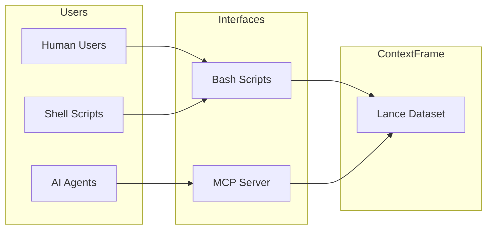

# CLI Tools and Bash Scripts

ContextFrame provides two ways to interact via command line: the MCP server for AI agents and direct bash scripts for human users and simple integrations.

## Overview



## Bash Scripts (Direct CLI)

ContextFrame includes bash script wrappers in `contextframe/scripts/` that provide direct command-line access to core functionality. These are ideal for:

- Human users working in the terminal
- Shell script automation
- Simple integrations
- Quick operations without running a server

### Available Scripts

1. **contextframe-search** - Search documents using text, vector, or hybrid search
2. **contextframe-add** - Add documents to a dataset with optional chunking and embeddings
3. **contextframe-get** - Retrieve specific documents by ID
4. **contextframe-list** - List and filter documents in a dataset

### Quick Examples

```bash
# Search for documents
contextframe-search data.lance "machine learning" --limit 10

# Add a document
contextframe-add data.lance document.txt --collection "docs" --embeddings

# Get a specific document
contextframe-get data.lance doc-123 --format markdown

# List documents in a collection
contextframe-list data.lance --collection "research" --format json
```

### Installation

Add to your PATH:
```bash
export PATH="$PATH:/path/to/contextframe/contextframe/scripts"
```

Or create symlinks:
```bash
ln -s /path/to/contextframe/contextframe/scripts/contextframe-* /usr/local/bin/
```

### When to Use Bash Scripts

- **Quick Operations**: One-off searches or document additions
- **Shell Integration**: Part of bash pipelines or scripts
- **Human Interface**: Direct terminal usage
- **Simple Automation**: Cron jobs, basic workflows

## MCP Server (AI Agent Interface)

The MCP server provides a standardized protocol for AI agents with advanced features:

### Features Beyond Bash Scripts

1. **Stateful Operations**: Maintain context across requests
2. **Batch Processing**: Efficient bulk operations
3. **Real-time Updates**: Streaming and subscriptions
4. **Advanced Security**: Authentication, authorization, rate limiting
5. **Monitoring**: Metrics, logging, tracing
6. **43+ Tools**: Comprehensive tool suite

### Quick Start

```bash
# Start MCP server
contextframe-mcp serve --port 8000

# Or in stdio mode for Claude Desktop
contextframe-mcp stdio
```

### When to Use MCP Server

- **AI Agent Integration**: Claude, GPT, LangChain
- **Production Systems**: Scalable, monitored deployments
- **Complex Operations**: Transactions, streaming, subscriptions
- **Multi-user Access**: Authentication and authorization
- **API Access**: RESTful HTTP interface

## Comparison

| Feature | Bash Scripts | MCP Server |
|---------|-------------|------------|
| **Interface** | Command line | HTTP/stdio API |
| **Target Users** | Humans, shell scripts | AI agents, applications |
| **Setup** | Just PATH config | Run server process |
| **Authentication** | File system permissions | API keys, OAuth |
| **Operations** | Basic CRUD + search | 43+ advanced tools |
| **Performance** | Single operations | Batch, streaming |
| **Monitoring** | Basic exit codes | Full metrics/logging |
| **State** | Stateless | Stateful sessions |

## Migration Path

### From Bash Scripts to MCP

If you're currently using bash scripts and want to migrate to MCP:

```python
# Bash script approach
subprocess.run(["contextframe-search", "data.lance", "query"])

# MCP client approach
from contextframe.mcp import MCPClient
client = MCPClient("http://localhost:8000")
results = client.search_documents(query="query")
```

### Using Both Together

You can use both interfaces in the same workflow:

```bash
# Use bash script for one-off import
contextframe-add data.lance documents/*.txt --embeddings

# Then use MCP server for application
contextframe-mcp serve --dataset data.lance
```

## Environment Configuration

Both interfaces share embedding configuration:

```bash
# OpenAI embeddings
export OPENAI_API_KEY="sk-..."
export CONTEXTFRAME_EMBED_MODEL="text-embedding-ada-002"

# Works for both:
contextframe-add data.lance doc.txt --embeddings  # Bash script
# AND
client.document_create(content="...", generate_embeddings=True)  # MCP
```

## Examples

### Bash Script Pipeline

```bash
#!/bin/bash
# Simple document processing pipeline

# Add documents
find ./docs -name "*.md" | while read file; do
    contextframe-add knowledge.lance "$file" \
        --collection "documentation" \
        --chunk-size 1000
done

# Search and process results
contextframe-search knowledge.lance "$1" --format json | \
    jq '.results[] | {id, score, title: .metadata.title}'
```

### MCP Integration

```python
# AI agent with context
class ContextAgent:
    def __init__(self):
        self.mcp = MCPClient("http://localhost:8000")
    
    def answer_with_context(self, question):
        # Get relevant context
        results = self.mcp.search_documents(
            query=question,
            limit=5
        )
        
        # Use context in response
        context = "\n".join([doc['content'] for doc in results['documents']])
        return self.generate_answer(question, context)
```

## Best Practices

### For Bash Scripts

1. **Use for Simple Tasks**: One-off operations, quick searches
2. **Pipe-Friendly**: Design scripts to work in pipelines
3. **Error Handling**: Check exit codes
4. **JSON Output**: Use `--format json` for parsing

### For MCP Server

1. **Use for Applications**: AI agents, web apps, services
2. **Monitor Performance**: Enable metrics and logging
3. **Secure Access**: Always use authentication in production
4. **Batch Operations**: Group related operations

## Troubleshooting

### Bash Scripts

```bash
# Debug mode
export DEBUG=1
contextframe-search data.lance "test"

# Check script location
which contextframe-search

# Verify dataset
ls -la data.lance/
```

### MCP Server

```bash
# Check server health
curl http://localhost:8000/health

# View logs
contextframe-mcp serve --log-level DEBUG

# Test with curl
curl -X POST http://localhost:8000/mcp/v1/tools/list_tools
```

## Next Steps

- **Bash Scripts**: See [full documentation](https://github.com/contextframe/contextframe/blob/main/contextframe/scripts/README.md)
- **MCP Quick Start**: Follow the [5-minute guide](../getting-started/quickstart.md)
- **AI Integration**: See [agent integration guide](agent-integration.md)
- **Production Setup**: Check [deployment guide](production-deployment.md)