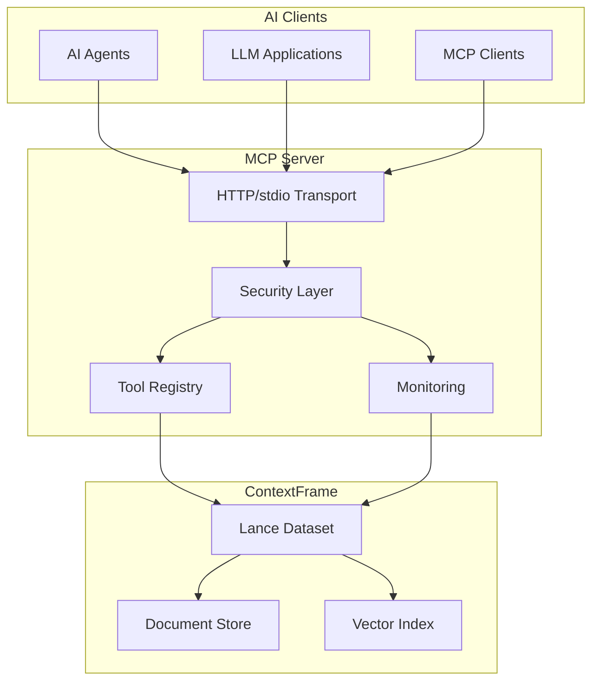

# ContextFrame MCP Server

The ContextFrame Model Context Protocol (MCP) server provides a standardized interface for AI agents and language models to interact with ContextFrame datasets. Built on the MCP specification, it enables seamless integration with any MCP-compatible client.

## What is MCP?

The Model Context Protocol (MCP) is an open standard that enables seamless communication between AI models and external systems. ContextFrame's MCP server implements this protocol to provide:

- **Standardized Access**: Uniform interface for querying and managing document collections
- **Tool-based Interaction**: Rich set of tools for document operations, search, and analysis
- **Transport Flexibility**: Support for HTTP (primary) and stdio transports
- **Production Ready**: Built-in security, monitoring, and performance optimization

## Key Features

### 🔧 Comprehensive Tool Suite

- **Document Operations**: Create, read, update, delete documents
- **Advanced Search**: Full-text, semantic, and hybrid search capabilities
- **Collection Management**: Organize documents into logical collections
- **Batch Processing**: Efficient bulk operations with transactional support
- **Analytics**: Usage tracking, performance monitoring, and cost attribution

### 🔒 Enterprise Security

- **Multi-Provider Authentication**: API keys, OAuth 2.1, JWT tokens
- **Fine-grained Authorization**: Role-based and resource-level access control
- **Rate Limiting**: Protect against abuse with configurable limits
- **Comprehensive Audit Logging**: Track all operations for compliance

### 📊 Built-in Monitoring

- **Performance Metrics**: Track operation latency and throughput
- **Usage Analytics**: Monitor document and query patterns
- **Cost Attribution**: Calculate and track LLM operation costs
- **Real-time Dashboards**: Visualize system health and usage

### 🚀 Production Ready

- **HTTP-First Design**: RESTful API with optional SSE streaming
- **Horizontal Scalability**: Stateless design for easy scaling
- **Error Handling**: Graceful degradation and detailed error messages
- **Extensive Testing**: Comprehensive test coverage

## Quick Navigation

-   :material-rocket-launch: **[Getting Started](getting-started/quickstart.md)**
    
    Get up and running with the MCP server in 5 minutes

-   :material-book-open: **[Core Concepts](concepts/overview.md)**
    
    Understand the fundamental concepts and architecture

-   :material-tools: **[API Reference](api/tools.md)**
    
    Complete reference for all MCP tools and operations

-   :material-shield-check: **[Security Guide](configuration/security.md)**
    
    Configure authentication, authorization, and security features

-   :material-chart-line: **[Monitoring Setup](configuration/monitoring.md)**
    
    Set up metrics collection and performance monitoring

-   :material-puzzle: **[Integration Guides](guides/agent-integration.md)**
    
    Connect your AI agents and applications to ContextFrame

## Use Cases

The ContextFrame MCP server is ideal for:

- **AI Agent Development**: Provide agents with structured access to document collections
- **RAG Applications**: Build retrieval-augmented generation systems with rich context
- **Document Intelligence**: Extract insights from large document repositories
- **Knowledge Management**: Organize and query organizational knowledge bases
- **Research Tools**: Analyze and synthesize information from diverse sources

## Architecture Overview

## Next Steps

1. **[Install and Configure](getting-started/installation.md)** - Set up your MCP server
2. **[Follow the Quickstart](getting-started/quickstart.md)** - Build your first integration
3. **[Explore Tools](api/tools.md)** - Learn about available operations
4. **[Configure Security](configuration/security.md)** - Set up authentication and authorization
5. **[Join the Community](https://github.com/greyhaven-ai/contextframe)** - Get help and contribute

## Getting Help

- **Documentation**: You're in the right place!
- **GitHub Issues**: [Report bugs or request features](https://github.com/greyhaven-ai/contextframe/issues)
- **Discussions**: [Ask questions and share ideas](https://github.com/greyhaven-ai/contextframe/discussions)
- **Examples**: Check out the [cookbook](cookbook/index.md) for practical examples

## License

ContextFrame is open source software licensed under the MIT License.