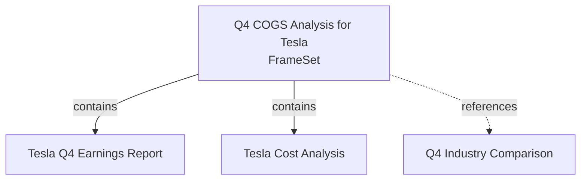

# FrameSet Export/Import

ContextFrame supports exporting and importing FrameSets - curated collections of documents with their relationships and metadata. This feature enables portability, version control, and easy sharing of context between teams and AI agents.

## Overview

FrameSets can be exported to various formats:
- **Markdown** (recommended) - Human-readable with YAML frontmatter
- **JSON** - Structured data interchange
- **Text** - Simple plain text format
- **Parquet** - Columnar format for data analysis
- **CSV** - Tabular format for spreadsheets

## Exporting FrameSets

### Basic Export

```python
from contextframe import FrameDataset
from contextframe.io import FrameSetExporter, ExportFormat

# Open your dataset
dataset = FrameDataset.open("my_dataset.lance")

# Create an exporter
exporter = FrameSetExporter(dataset)

# Export a frameset to Markdown (default)
exporter.export_frameset(
    frameset_uuid="550e8400-e29b-41d4-a716-446655440000",
    output_path="my_frameset.md"
)
```

### Export Options

```python
# Export with all frames included (default: True)
exporter.export_frameset(
    frameset_uuid=frameset.uuid,
    output_path="full_frameset.md",
    include_frames=True,
    single_file=True  # All content in one file
)

# Export frameset header only (without frames)
exporter.export_frameset(
    frameset_uuid=frameset.uuid,
    output_path="frameset_header.md",
    include_frames=False
)

# Multi-file export (index.md + frame files)
exporter.export_frameset(
    frameset_uuid=frameset.uuid,
    output_path="frameset_bundle.md",
    include_frames=True,
    single_file=False  # Creates frameset_bundle/index.md + frame_*.md
)
```

### Export Formats

```python
# Export to different formats
exporter.export_frameset(
    frameset_uuid=frameset.uuid,
    output_path="frameset.json",
    format=ExportFormat.JSON
)

# Other formats
formats = [
    ExportFormat.TEXT,     # Simple text
    ExportFormat.PARQUET,  # Columnar data
    ExportFormat.CSV       # Spreadsheet
]
```

## Markdown Export Format

The Markdown format is optimized for both human readability and AI agent parsing:

```markdown
---
uuid: 550e8400-e29b-41d4-a716-446655440000
title: Q4 COGS Analysis for Tesla
record_type: frameset
created_at: '2025-06-11'
tags:
- analysis
- tesla
- q4
custom_metadata:
  source_query: What was Tesla's Q4 COGS?
  frame_count: '3'
---

# Q4 COGS Analysis for Tesla

## Summary

Based on analysis of Tesla's Q4 reports...

## Source Query

```
What was Tesla's Q4 COGS?
```

## Relationship Visualization



## Frames (3)

### 1. Tesla Q4 Earnings Report
...
```

### Features

1. **YAML Frontmatter**: All metadata preserved for reconstruction
2. **Relationship Diagram**: Mermaid visualization of document connections
3. **Frame Content**: Full content and metadata for each referenced document
4. **Usage Instructions**: Built-in guidance for humans and AI agents

## Importing FrameSets

### Basic Import

```python
from contextframe import FrameDataset
from contextframe.io import FrameSetImporter

# Open target dataset
dataset = FrameDataset.open("target_dataset.lance")

# Create importer
importer = FrameSetImporter(dataset)

# Import from Markdown
imported_frameset = importer.import_frameset("my_frameset.md")
```

### Conflict Resolution

When importing, you can handle existing records in three ways:

```python
# Skip existing records (default)
frameset = importer.import_frameset(
    "frameset.md",
    conflict_strategy="skip"
)

# Replace existing records
frameset = importer.import_frameset(
    "frameset.md", 
    conflict_strategy="replace"
)

# Generate new UUIDs for all records
frameset = importer.import_frameset(
    "frameset.md",
    conflict_strategy="new_uuid"
)
```

### Import Options

```python
# Import frameset header only
frameset = importer.import_frameset(
    "frameset.md",
    import_frames=False  # Only import the frameset, not frames
)

# Import from JSON
frameset = importer.import_frameset("frameset.json")
```

## Use Cases

### 1. Team Collaboration

Export context for new team members:

```python
# Export onboarding context
frameset = dataset.create_frameset(
    title="Project Onboarding Context",
    content="Essential documents for new team members",
    source_records=[
        (arch_doc.uuid, "System architecture overview"),
        (api_doc.uuid, "API design principles"),
        (style_guide.uuid, "Code style guidelines")
    ],
    tags=["onboarding", "documentation"]
)

exporter.export_frameset(frameset.uuid, "onboarding.md")
```

### 2. Version Control

Track context evolution in Git:

```python
# Export for version control
exporter.export_frameset(
    frameset.uuid,
    output_path="context/q4_analysis.md"
)

# Later: git add, commit, push
```

### 3. AI Agent Context

Prepare context for Claude or other AI assistants:

```python
# Export with specific formatting for AI
frameset = dataset.create_frameset(
    title="Code Review Context",
    content="Recent changes and architectural decisions",
    custom_metadata={
        "agent_hints": "Focus on security implications",
        "priority_order": "1. Security, 2. Performance, 3. Maintainability"
    }
)

exporter.export_frameset(
    frameset.uuid,
    "code_review_context.md",
    include_frames=True,
    single_file=True  # AI agents prefer single files
)
```

### 4. Multi-Dataset Synchronization

Sync framesets between datasets:

```python
# Export from source
source_dataset = FrameDataset.open("source.lance")
exporter = FrameSetExporter(source_dataset)
exporter.export_frameset(frameset_uuid, "sync_temp.md")

# Import to target
target_dataset = FrameDataset.open("target.lance")
importer = FrameSetImporter(target_dataset)
importer.import_frameset("sync_temp.md", conflict_strategy="replace")
```

## Best Practices

1. **Use Markdown for Portability**: The Markdown format with YAML frontmatter is the most versatile

2. **Include Semantic Metadata**: Add meaningful tags and descriptions for better discoverability

3. **Document Relationships**: Use appropriate relationship types (contains, references, member_of)

4. **Version Control Integration**: Export framesets to track context evolution over time

5. **Single vs Multi-File**: 
   - Single file: Better for AI agents, email, quick sharing
   - Multi-file: Better for large framesets, selective editing

6. **Conflict Strategy**:
   - `skip`: Safe default, preserves existing data
   - `replace`: Updates existing records
   - `new_uuid`: Creates duplicates with new IDs

## Related Documentation

- [Collections and Relationships](collections_relationships.md)
- [FrameSet API Reference](../api/frameset.md)
- [Schema Guide](../concepts/schema_cheatsheet.md)